# Урок 10 - Статическая и динамическая маршрутизация

**Дата:** 27.06.2025

**Видеоурок:** [10.Видео уроки Cisco Packet Tracer. Курс молодого бойца. Статическая маршрутизация](https://vkvideo.ru/playlist/-32477510_12/video-32477510_456239177)

**Цель урока:** Повторение ранее изученного материала

---

## Основные задачи 
- Настроить связь между малым и большим офисами (из урока 9)
- Познакомиться с таблицей маршрутизации
- Разобрать ключевые понятия:

| Термин | Описание |
|--------|----------|
| **Маршрутизация** | Процесс выбора пути для передачи пакетов между сетями. |
| **Маршрут** | Путь от VLAN до роутера, по которому отправляются пакеты. |
| **Таблица маршрутизации** | Список всех маршрутов, известных устройству. |
| **Статическая маршрутизация**| Ручное добавление маршрутов. |
| **Динамическая маршрутизация**| Автоматическое обновление маршрутов по протоколам (например, RIP, OSPF). |

---

## Теория

- Для связи между разными VLAN необходим уровень 3 (L3) - маршрутизатор или коммутатор с L3.
-  Таблица маршрутизации содержит:
  - IP-адрес назначения
  - Маску сети
  - Адрес следующего узла (next-hop)
- Маршруты должны быть **в обе стороны** (туда и обратно).
- По умолчанию, если сеть неизвестна - данные отправляются через **дефолтный маршрут** (0.0.0.0/0).

---

## Практика

### Схема IP-адресации 

#### Малый офис

|Устройство| IP-адресс   | Шлюз        | Маска сети    | № Vlan | Vlan name |
|----------|-------------|-------------|---------------|---------|-----------|
| PC0      | 192.168.2.2 | 192.168.2.1 | 255.255.255.0 |    2    |   VLAN2   |
| PC1      | 192.168.3.2 | 192.168.3.1 | 255.255.255.0 |    3    |   VLAN3   |
| PC2      | 192.168.4.2 | 192.168.4.1 | 255.255.255.0 |    4    |   VLAN4   |

#### Большой офис

|Устройство | IP-адресс    | Шлюз        | Маска сети    | № Vlan | Vlan name |
|-----------|--------------|-------------|---------------|---------|-----------|
| PC3       | 192.168.22.2 | 192.168.2.1 | 255.255.255.0 |    2    |   VLAN2   |
| PC4       | 192.168.33.2 | 192.168.3.1 | 255.255.255.0 |    3    |   VLAN3   |
| PC5       | 192.168.22.3 | 192.168.2.1 | 255.255.255.0 |    2    |   VLAN2   |
| PC6       | 192.168.33.3 | 192.168.4.1 | 255.255.255.0 |    3    |   VLAN3   |
| Server0   | 192.168.44.2 | 192.168.4.1 | 255.255.255.0 |    4    |   VLAN4   |
| Server1   | 192.168.44.3 | 192.168.4.1 | 255.255.255.0 |    4    |   VLAN4   |
| L3 switch | 192.168.55.2 | 192.168.5.1 | 255.255.255.0 |    5    |   VLAN5   |
| Router1   | 192.168.55.1 | 192.168.5.1 | 255.255.255.0 |    5    |   VLAN5   |

- Проверить связь хостов в малом офисе
- Проверить связь хостов в большом офисе 
- Проверить связь Router1 и L3 switch

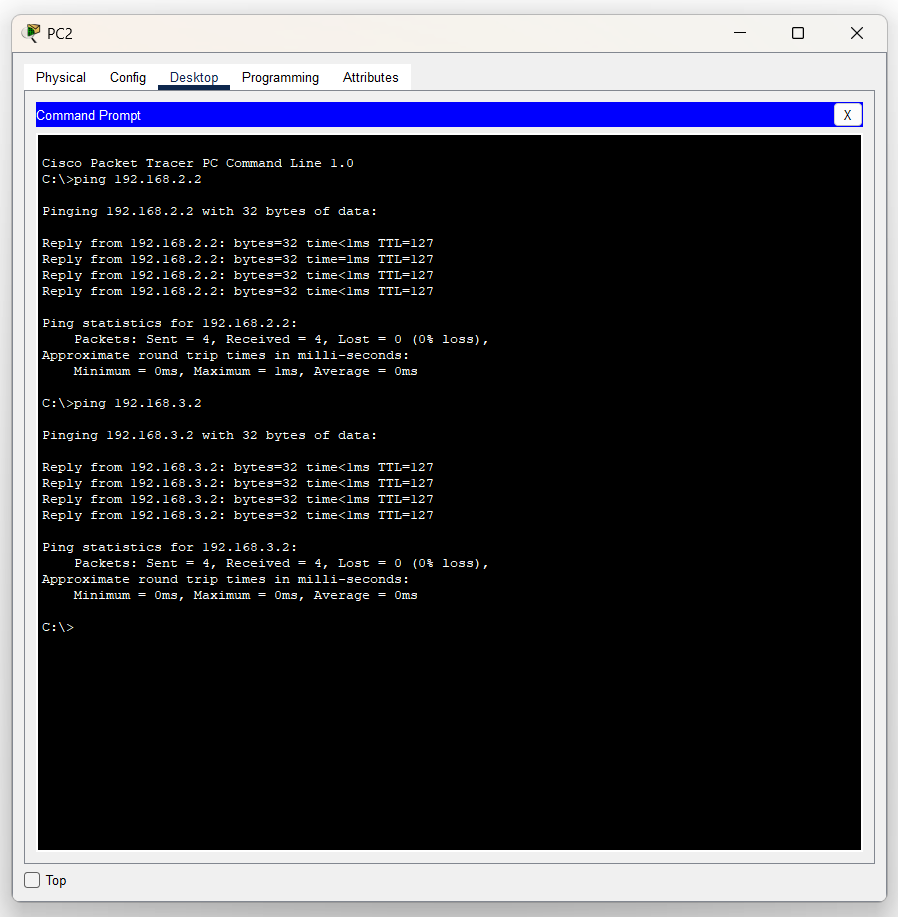
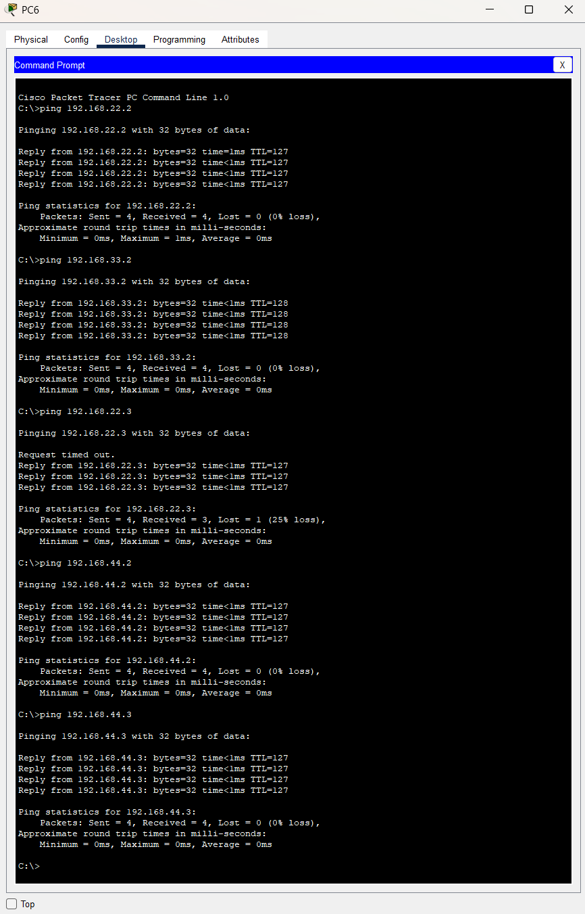
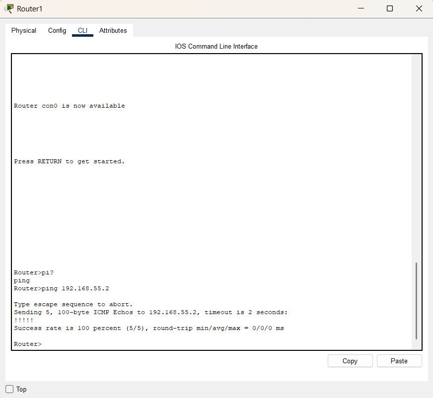

### Настройка маршрутов

#### Статические маршруты для Router1
- Чтобы роутер мог пропинговать остальные сегменты сети - нужно указать статические маршруты

| Назначение   | Маска         | Следующий хоп |
|--------------|---------------|---------------|
| 192.168.22.0 | 255.255.255.0 | 192.168.55.2  |
| 192.168.33.0 | 255.255.255.0 | 192.168.55.2  |
| 192.168.44.0 | 255.255.255.0 | 192.168.55.2  |
| 192.168.2.0  | 255.255.255.0 | 192.168.70.2  |
| 192.168.3.0  | 255.255.255.0 | 192.168.70.2  |
| 192.168.4.0  | 255.255.255.0 | 192.168.70.2  |

#### Дефолтные маршруты

| Устройство | Маршрут по умолчанию      |
|------------|---------------------------|
| Router0    | 0.0.0.0/0 -> 192.168.70.1 |
| Router1    | 0.0.0.0/0 -> 192.168.70.2 |
| L3 switch  | 0.0.0.0/0 -> 192.168.55.1 |

#### Примеры команд
```bash
# Маршрут через L3 switch в vlan 2
Router(config)#ip route 192.168.22.0 255.255.255.0 192.168.55.2

# Маршрут через L3 switch в vlan 3
Router(config)#ip route 192.168.33.0 255.255.255.0 192.168.55.2

# Маршрут через L3 switch в vlan 4
Router(config)#ip route 192.168.44.0 255.255.255.0 192.168.55.2
```
- Проверить соединение router1 с vlan
  - Пинг прошёл успешно т.к., у всех сегментов сети есть шлюз по умолчанию и все пакеты приходят на L3 коммутатор в случае межсетевого взаимодействия 
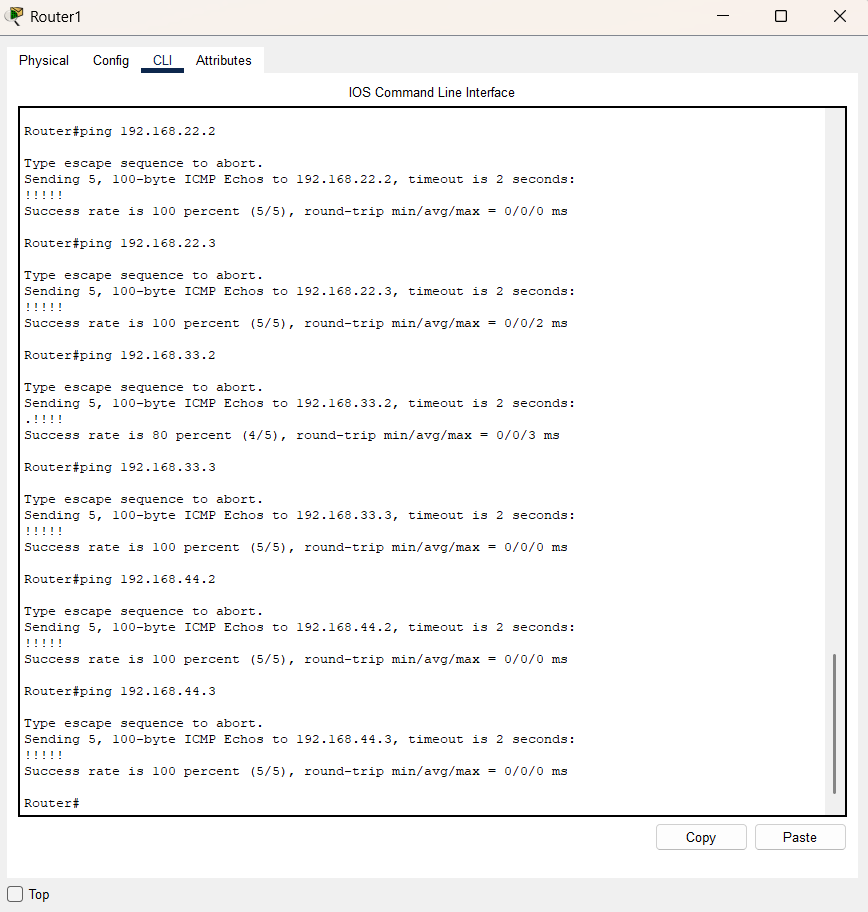

---

#### Соединение малого и большого офисов
** Прямое соединение Router0 <-> Router1 через подсеть 192.168.70.0/30
- Настроить gigabitEthernet 0/1 на Router1
```bash
Router(config) interface gigabitEthernet 0/1
Router(config-if) no shutdown 
Router(config-if) ip address 192.168.70.1 255.255.255.252
# Маска 30-бит, потому что достаточно 2 IP-адреса
```

- Настроить fastEthernet 0/1 на Router0
```bash
Router(config) interface fastEthernet 0/1
Router(config-if) no shutdown 
Router(config-if) ip address 192.168.70.2 255.255.255.252
# IP-адрес из той же подсети как на Router1
```
- Проверить пинг Router0 to Router1
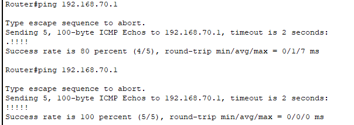

- Прописать маршрут по умолчанию на Router0, для связи компьютеров малого и большого офисов
```bash
Router(config)# ip route 0.0.0.0 0.0.0.0 192.168.70.1
```

- Посмотреть таблицу маршрутизации

```bash
Router show ip route 
```
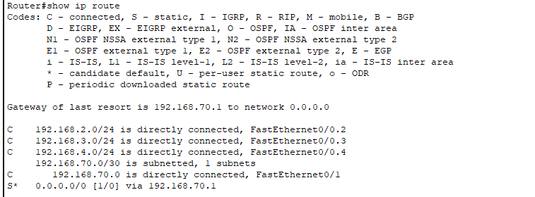
- C - connected - присоединенные сети
- S - static - статический маршрут (дефолтный)

- Прописать статический маршрут на L3-коммутаторе
```bash
Switch(config) ip route 0.0.0.0 0.0.0.0 192.168.55.1
```
- Прописать маршрут на Router1 в vlan на Router0
```bash
Router(config) ip route 192.168.2.0 255.255.255.0 192.168.70.2
Router(config) ip route 192.168.3.0 255.255.255.0 192.168.70.2
Router(config) ip route 192.168.4.0 255.255.255.0 192.168.70.2
```
- Проверить ping между разными сегментами сети
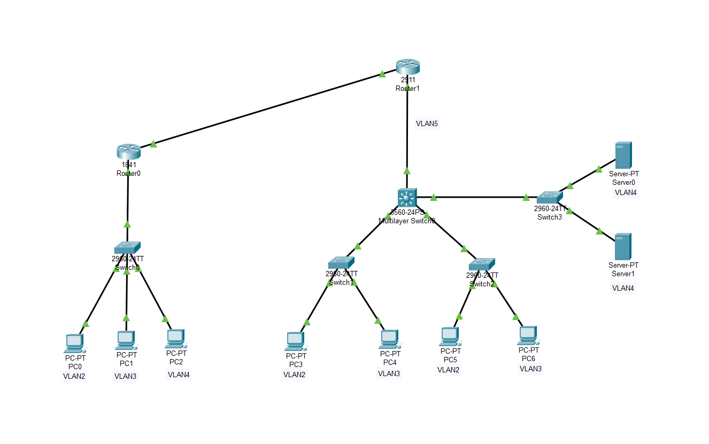
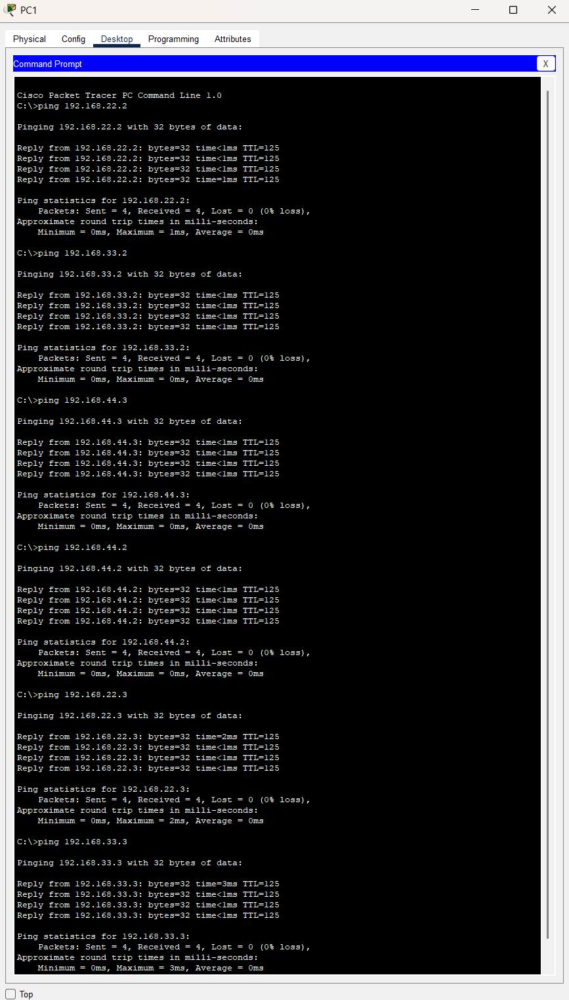

---

## Усложним задачу!
- Добавлен Router2 между офисами
 - Подсети:
  - 192.168.70.0/24 -> между Router0 и Router2
  - 192.168.80.0/24 -> между Router2 и Router1 
 - Скореектировать IP и маршруты на всех трёх роутерах

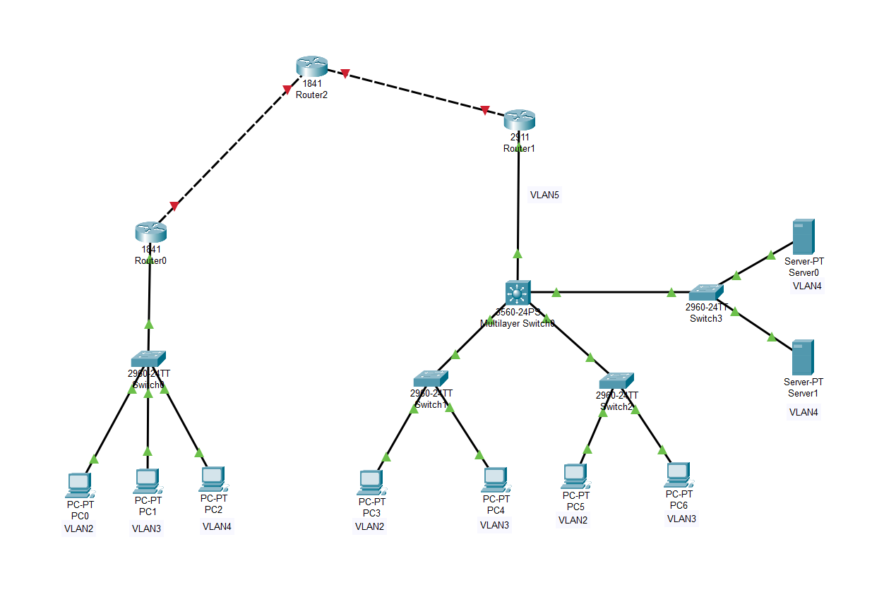

#### 

- Настроить Router2
```bash
# Настрорить Fa0/0 в сторону малого офиса
Router(config) interface fastEthernet 0/0
Router(config-if) no shutdown 
Router(config-if) ip address 192.168.70.1 255.255.255.0

# Настрорить Fa0/1 в сторону большого офиса
Router(config) interface fastEthernet 0/1
Router(config-if) no shutdown
Router(config-if)#ip address 192.168.80.1 255.255.255.0

# Прописать маршруты в сегменты малого офиса
Router(config)#ip route 192.168.2.0 255.255.255.0 192.168.70.2
Router(config)#ip route 192.168.3.0 255.255.255.0 192.168.70.2
Router(config)#ip route 192.168.4.0 255.255.255.0 192.168.70.2

# Прописать маршруты в сегменты большого офиса
Router(config)#ip route 192.168.22.0 255.255.255.0 192.168.80.2
Router(config)#ip route 192.168.33.0 255.255.255.0 192.168.80.2
Router(config)#ip route 192.168.44.0 255.255.255.0 192.168.80.2
```

- Скорректировать настройки на Router0
```bash 
# Скорректировать маску сети
Router(config) interface fastEthernet 0/1
Router(config-if) ip address 192.168.70.2 255.255.255.0
```
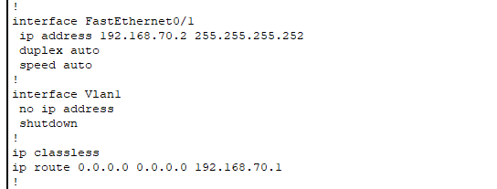
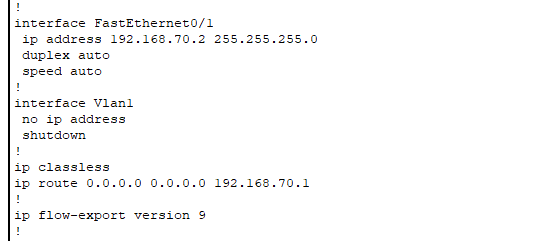

- Скорректировать настройки на Router1
```bash
# Скорректировать маршрут к Router2 
Router(config) interface gigabitEthernet 0/1
Router(config-if) ip address 192.168.80.2 255.255.255.0

# Удалить старые маршруты во внешнюю сеть
Router(config) no ip route 192.168.2.0 255.255.255.0 192.168.70.2 
Router(config) no ip route 192.168.3.0 255.255.255.0 192.168.70.2 
Router(config) no ip route 192.168.4.0 255.255.255.0 192.168.70.2 

# Прописать статический маршрут
Router(config) ip route 0.0.0.0 0.0.0.0 192.168.80.1
```
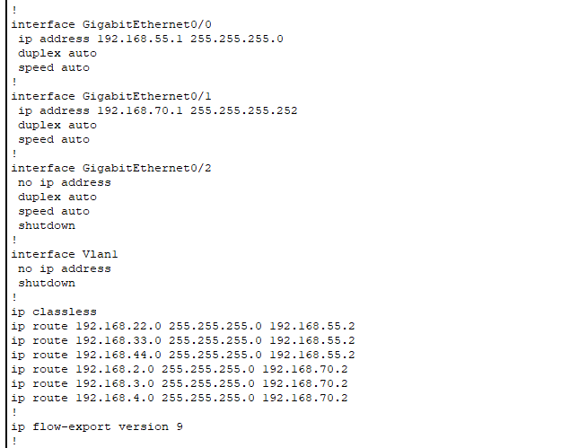
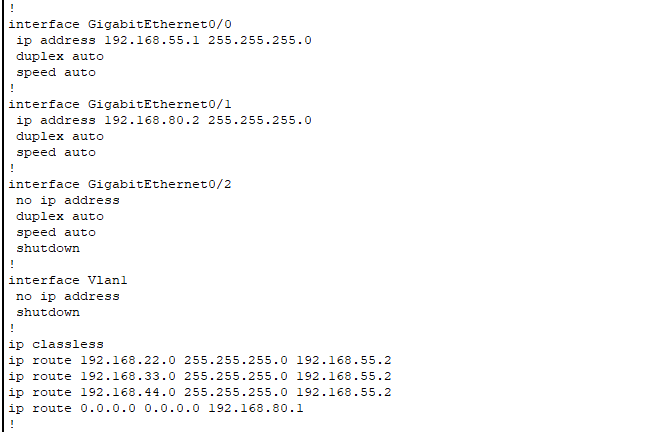

- Проверить пинг во всех сегменты сети
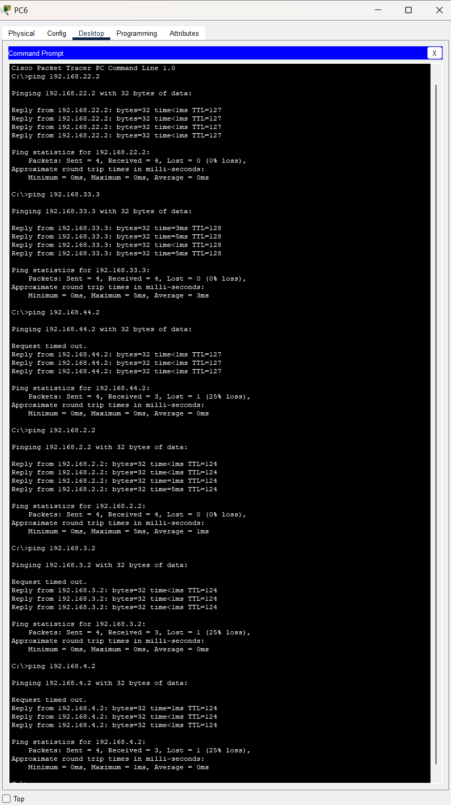

---

## Вывод
- Если заранее планировать топологию и делать таблицу с IP-адресацией - то это сильно облегчает работу
- Статическая маршрутизация удобно дня небольших, предсказуемых сетей.
- Надо не забывать прописывать обратные маршруты!