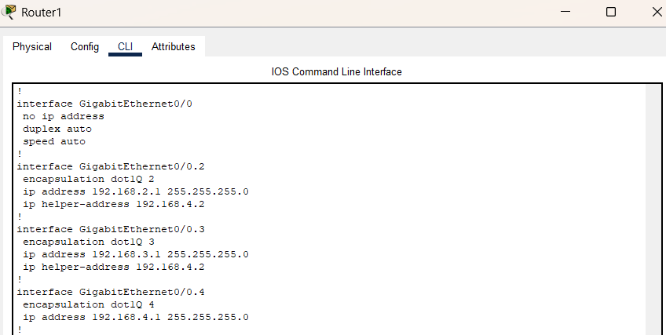
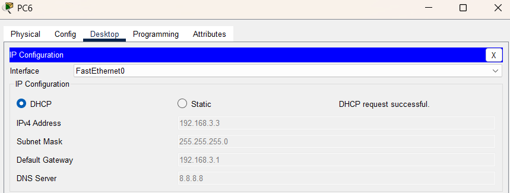

# Урок 11 - DHCP-протокол

**Дата:** 29.06.2025

**Видеоурок:** [11.Видео уроки Cisco Packet Tracer. Курс молодого бойца. DHCP](https://vkvideo.ru/playlist/-32477510_12/video-32477510_456239175)

**Цель урока:** Повторение ранее изученного материала

---

## Основные задачи 
- Освоение и практическая отработка настройки DHCP-протокола в Cisco Packet Tracer. Работа с автоматической раздачей IP-адресов в простой и VLAN-сегментированной сетях.

---

## Теория
- При подключении компьютера к сети он начинает искать DHCP-сервер и рассылает широковещательный запрос - пакет (DHCPDISCOVER). (DHCPOFFER) - ответный пакет с предложенным IP-адресом который отправляет DHCP-сервер компьютеру. 
- Компьютер отсылает запрос на предложенный адрес (DHCPREQUEST) - в ответ сервер отсылает подтверждение (DHCPPACK).
- Потом компьютер настраивает свой сетевой интерфейс без вмешательства человека.
- В качестве DHCP-сервера можно использовать маршрутизатор
## Практика

---

## Практика

План работы:
- простая топология
- топология по сложнее

---

### Простая топология

- 1х Router (Router0)
- 3х PC (PC0, PC1, PC2)
- 1х L2 Switch (Switch0)
- DHCP-сервер встроен в маршрутизатор


- Настроить Router0
Поднять линк и задать IP-адрес
```bash
Router(config) interface fastEthernet 0/0
Router(config-if) no shutdown 
Router(config-if) ip address 192.168.1.1 255.255.255.0
```

- **Создать DHCP-pool:**
  - Задать сеть из которой будут раздаваться DHCP-адреса (сеть должна быть из той же сети, что IP-адрес на интерфейсе маршрутизатора)
  - Задать дефолтный маршрут 
  - Задать сеть для выхода в интернет (DNS-сервер)
  - Исключим IP-адрес сервера с DHCP-пулом

```bash
# Создание пула
Router(config) ip dhcp pool DHCP 

# Задать сеть 
Router(dhcp-config) network 192.168.1.0 255.255.255.0

# Выдать компьютеру дефолтный маршрут
Router(dhcp-config) default-router 192.168.1.1 

# Указать DNS-сервер  
Router(dhcp-config) default-router 192.168.1.1 

# Исключить IP-адрес
Router(config) ip dhcp excluded-address 192.168.1.1
```

- В настройках компьютеров установить галочку со static на dhcp


- Аналогично с остальными компьютерами


- Проверить какому компьютеру какой IP-адрес был выдан
```bash
Router show ip dhcp binding 
```


#### Настройка завершена

- Все ПК получили IP-адреса через DHCP
- DHCP Relay корректно перенаправляет запросы
- show ip dhcp binding показывает назначенные адреса
- Пинг между устройствами успешен во всех сегментах


---


### Топология сложнее с VLAN и DHCP Relay

- VLAN 2/3/4 на управляемом коммутаторе
- Router-on-a-stick (интерфейсы g0/0.X)
- Внешний DHCP-сервер в vlan 4
- Используется 'ip helper-address' для ретрансляции DHCP-запросов


- Настроить Switch1:
  - Создать VLAN 2/3/4
  - Сделать trunk-порт 


- Настроить Router0:
  - Поднять линк
  - Создать Sub-интерфейсы для VLAN 2/3/4

```bash
# Поднятие линка 
Router(config) interface gigabitEthernet 0/0
Router(config-if) no shutdown 

# Создание и настройка Sub-интерфейса
Router(config) interface gigabitEthernet 0/0.2
Router(config-subif) ip address 192.168.2.1 255.255.255.0
Router(config-subif) no shutdown 
```


#### Настройка DHCP-сервера

- Настроить статический IP-адрес
  - 192.168.4.2/24 - шлюз 192.168.4.1
  - Проверить соединение с Switch1 - успешно

- Перейти в настройки DHCP на Server0
  - Вкладка Services -> DHCP

- Создать DHCP-пул для VLAN2
  - Указать Pool-name - в имени будет хорошо указать имя VLAN
  - Дефолтный шлюз - IP-адрес который указан на маршрутизаторе для данной VLAN
  - Start IP-адрес - IP-адрес сети в которой находится VLAN 
  - DNS-сервер - в этой работе также укажем DNS-сервер гугла - 8.8.8.8
  - Включить и добавить

Результат настройки

- DHCP-пул VLAN2 будет работать на сегмент сети vlan 2
- DHCP-пул VLAN3 будет работать на сегмент сети vlan 3


#### Функция DHCP-relay
- Эта функция нужна чтобы переадресовать широковещательные запросы компьютеров на DHCP-сервер

- Настроить перенаправление DHCP-запросов для Sub-интерфейсов
```bash
# Настройка sub-интерфейса vlan 2
Router(config) interface gigabitEthernet 0/0.2
Router(config-subif) ip helper-address 192.168.4.2

# Настройка sub-интерфейса vlan 3
Router(config) interface gigabitEthernet 0/0.3
Router(config-subif) ip helper-address 192.168.4.2
```



- Получить IP-адреса на компьютерах




- Задача успешно реализована. Подтверждено полное взаимодействие устройств между VLAN, автоматическая IP-настройка и корректная маршрутизация.

---

## Вывод

- DHCP - мощный инструмент автоматизации IP-адресации
- При большом количестве клиентов ручная настройка затруднительна 
- DHCP Relay - позволяет централизовать DHCP-сервер
- Ошибки в подсетях и масках приводят к потере соединения

---

[Вернуться в начало](../README.md)