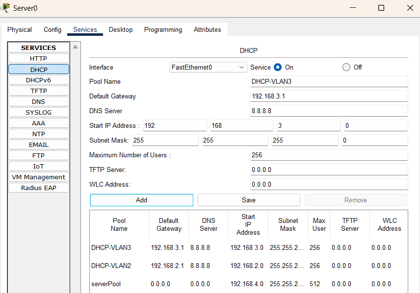
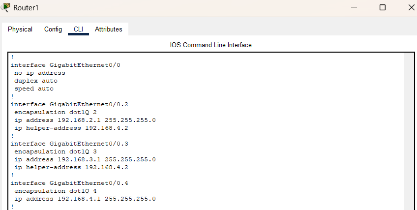
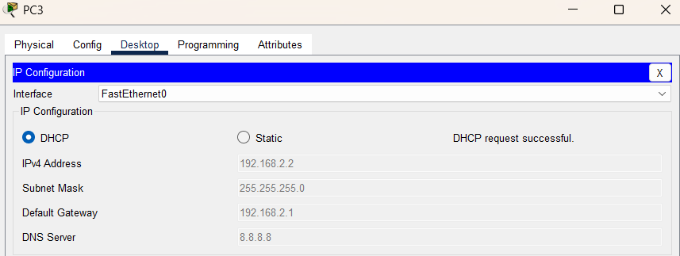
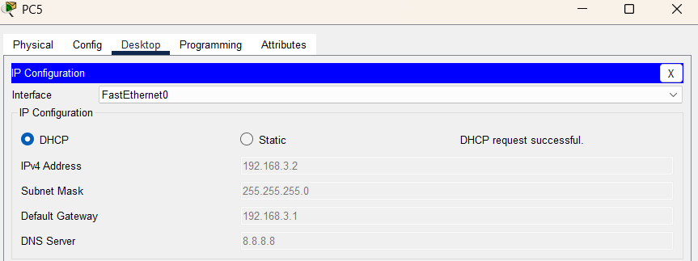

# Отчёт по Уроку 11 — DHCP

**Дата выполнения:** *29.06.2025*
**Тема:** Автоматизация адресации с помощью DHCP и DHCP Relay  
**Связанный урок:** [11.DHCP](../11.DHCP/README.md)

---

## Цель урока

- Настроить DHCP-сервер для автоматической выдачи IP-адресов клиентам в разных VLAN
- Изучить и применить механизм DHCP Relay для межсетевого взаимодействия

---

## Выполненные задачи

- Настроены DHCP-пулы для VLAN2 и VLAN3 с учётом:
  - Start IP, маски, шлюза и DNS-сервера (Google DNS — `8.8.8.8`)
- Реализована функция **DHCP Relay** на `Router1`:
  - Использованы команды `ip helper-address` на sub-интерфейсах VLAN 2 и 3
- Проведена настройка автоматического получения IP на компьютерах PC3–PC6
- Обеспечено корректное взаимодействие между сегментами сети и стабильная маршрутизация

---

## Скриншоты

- DHCP-пулы VLAN2/3:
  

- Конфигурация Router1:
  

- Получение IP по DHCP:
  - PC3: 
  - PC4: 
  - PC5: 
  - PC6: 

---

## Выводы

- **DHCP** — незаменим для автоматизации IP-настройки, особенно при большом количестве устройств
- **DHCP Relay** — упрощает инфраструктуру, позволяя централизовать DHCP-сервер
- Точное понимание подсетей, масок и шлюзов — критично для корректной работы DHCP
- Все компьютеры успешно получили адреса из нужных пулов, сетевое взаимодействие подтверждено

---

## Ошибки и решение

- Ошибки в масках/подсетях — на этапе настройки DHCP, выявлены и устранены
- DHCP-сервер изначально не обслуживал VLAN3 — проблема решена добавлением helper-адреса

---

[Вернуться к README](./README.md)
