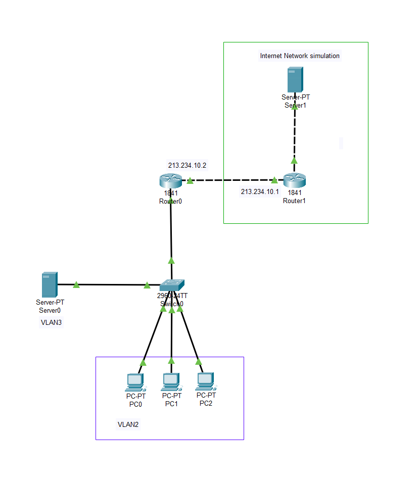

# Урок 12 - Технология NAT

**Дата:** 29.06.2025

**Видеоурок:** [12.Видео уроки Cisco Packet Tracer. Курс молодого бойца. NAT](https://vkvideo.ru/playlist/-32477510_12/video-32477510_456239176)

**Цель урока:** Повторение ранее изученного материала

---

## Основные задачи 
- Изучить технологию NAT, опробовать её использование

---

## Теория
**NAT (Network Address Translation)** - технология преобразования IP-адресов. Позволяет компьютерам с частными (серыми) адресами входить в интернет, используя публичные (белые) IP-адреса.

**Типы NAT:**
| Тип | Примерные диапазоны | Особенности |
|-----|---------------------|-------------|
| Частные | 192.168.0.0/16, 10.0.0.0/8 | Не маршрутизируются в интернете |
| Публичные | Выдаются провайдером | Маршрутизируются в интернете |

!!!!!!!!!!!!!!!?????????????????????????

- Типы NAT:
  - Статический NAT
  - Динамический NAT
  - Перегруженный NAT (PAT; overloaded NAT) 

- Статический NAT - преобразование серого IP-адреса в белый, используется для обеспечения доступа из сети интернет к локальному серверу с серым IP-адресом.

- Динамический NAT - преобразование серого адреса в один из группы белых IP-адресов.

- Перегруженный NAT - позволяет преобразовывать несколько серых адресов в один белый, используя различные порты, обеспечивая для всех доступ в интернет. Можно обеспечить интернетом весь офис используя один белый IP-адрес.

- Публичный IP-адерс (белый) - данные адреса маршрутизируются в сети интернет, они доступны из любой точки мира.

- Частный IP-адрес (серый) - используется исключительно в локальных сетях, не имеет доступа к сети интернет; данные адреса могут повторяться.

- Что такое IPv4
- Что такое IPv6

- Всегдо выделено 3 класса сетей для использования в локальных сетях:
  - Сеть класса А - от 10.0.0.0 до 10.255.255.255 с маской 255.0.0.0 (около 16 млн. адресов)
  - Сеть класса В - от 172.16.0.0 до 172.31.0.0 с маской 255.255.0.0 (около 65 тыс. адресов)
  - Сеть класса С - от 192.168.0.0 до 192.168.255.255 с маской 255.255.255.0 (около 256 адресов)

!!!!!!!!!!!!!!!!!!!!!!!????????????????????????

---

## Практика

### Топология 

2x Маршрутизатор (Router0, Router1)
1x L2-коммутатор (Switch0)
2x Сервер (Server0, Server1)
3x Компьютер (PC0, PC1, PC2)



---

### IP-адресация

|  Название | IP-адрес / Маска |
|-----------|------------------|
| PC0 | 192.168.2.2/24 | 
| PC1 | 192.168.2.3/24 |
| PC2 | 192.168.2.4/24 |
| Server0 | 192.168.3.2/24 |
| Server1 | 213.234.20.2/30 |
| Router0 | 213.234.10.2/30 | 
| Router1 | 213.234.10.1/30 |

---

### Настройка локальной сети

#### Настройка Access и Trunk порты на Switch0

```bash
# Настройка vlan 2
Switch(config) vlan 2
Switch(config-if) name VLAN2

# Настройка vlan для клиентов
Switch(config) interface range fastEthernet 0/1-3
Switch(config-if-range) switchport mode access 
Switch(config-if-range) switchport access vlan 2

# Настройка vlan 3
Switch(config) vlan 3
Switch(config-if) name SERVER

# Настройка vlan для сервера
Switch(config) interface fastEthernet 0/4
Switch(config-if-range) switchport mode access 
Switch(config-if-range) switchport access vlan 3

# Настройка Trunk порта для Router0
Switch(config) interface fastEthernet 0/5
Switch(config-if) switchport mode trunk 
Switch(config-if) switchport trunk allowed vlan 2,3

```


#### Настройка интерфейсов и подинтерфейсов на Router0

```bash
# Основной линк
Router(config) interface fastEthernet 0/0
Router(config-if) no shutdown 

# Подинтерфейс для vlan 2
Router(config) interface fastEthernet 0/0.2
Router(config-subif) encapsulation dot1Q 2
Router(config-subif) ip address 192.168.2.1 255.255.255.0
Router(config-subif) no shutdown 

# Подинтерфейс для vlan 3
Router(config) interface fastEthernet 0/0.3
Router(config-subif) encapsulation dot1Q 3
Router(config-subif) ip address 192.168.3.1 255.255.255.0
Router(config-subif) no shutdown 
```


### Подключение локальной сети к сети интернет
(Сеть интернет в Cisco Packet Tracer симулируем с помощью роутера и сервера с публичными IP-адресами)

#### Настройка Router1

```bash
# Настроить IP-адрес и поднять линк 
Router(config) interface fastEthernet 0/1
Router(config-if) ip address 213.234.10.1 255.255.255.252
Router(config-if) no shutdown 

# Симулируем белый IP-адрес сервера, который находится за роутером провайдера
Router(config) interface fastEthernet 0/0
Router(config-if) ip address 213.234.20.1 255.255.255.252
Router(config-if) no shutdown 
```


#### Настройка Server1
- Нужно настроить:
  - IP-адрес: 213.234.20.2
  - Маску сети: 255.255.255.252
  - Шлюз: 213.234.20.1


#### Соединить сегменты сети
- Задать IP-адрес выделенный провайдером и дефолтный маршрут
```bash
Router(config) interface fastEthernet 0/1
Router(config-if) ip address 213.234.10.2 255.255.255.252
Router(config-if) no shutdown 
Router(config-if) ip route 0.0.0.0 0.0.0.0 213.234.10.1
```
- Проверить соединение Router0 с Router1 и Server1


---

### Настройка NAT

Чтобы компьютеры с серыми IP-адресами получили доступ в интернет нужно указать внутренние/внешние интерфейсы на Router0

```bash
# Назначить внешний NAT интерфейс
Router(config) interface fastEthernet 0/1
Router(config-if) ip nat outside 

# Назначить внутрений NAT интерфейс
Router(config) interface fastEthernet 0/0.2
Router(config-subif) ip nat inside 

# Назначить внутрений NAT интерфейс
Router(config) interface fastEthernet 0/0.3
Router(config-subif) ip nat inside 

```


---

### Настройка PAT (перегруженный NAT)

Нужно создать access листы для NAT трафика

```bash
# Создать
Router(config)#ip access-list standard FOR-NAT

# Указать сеть
Router(config-std-nacl) permit 192.168.2.0 0.255.255.255
Router(config-std-nacl) permit 192.168.3.0 0.255.255.255

# Указываем что NAT нужно с inside, когда трафик проходит через порт fastEthernet 0/1 - дополнительно указывем параметр overload - и тем самым настраиваем PAT
Router(config) ip nat inside source list FOR-NAT interface fastEthernet 0/1 overload 

# Проверка трансляций NAT
Router show ip nat translations 

```


- Проверить пинг с Server0 к Server1


---

### Static NAT: доступ из внешней сети 
Обеспечить доступ к локальному веб-серверу из внешней сети (Static NAT)

- Для проброса порта 80(HTTP) на локальный веб-сервер надо прописать команду на Router0
```bash
Router(config) ip nat inside source static tcp 192.168.3.2 80 213.234.10.2 80
```

Для проверки с Server1 открыть http://231.234.10.2 в браузере


---

### Проверяем в режиме симуляции
- Видим, что пакет поступает с источником 192.168.2.2 на 213.234.20.2


- Когда пакет отправляется с Router0 то он уже поступает с источником 213.234.10.2 на 213.234.20.2


- Когда пакет идёт в обратную сторону и отправляется от Router0 к Switch0 - роутер посредством того, что он запомнил с какого компьютера была инициализирована данная сессия перенаправляет пакет от 213.234.20.2 на 192.168.2.2


--- 

## Вывод
- NAT - важнейшая технология сетевого взаимодействия.
- PAT позволяет "спрятать" множество за одним IP-адресом - при отправке пакета - просто меняется адрес его отправителя и когда пакет доходит до роутера с белым IP-адресом, то от него он уже как бы переотправляется и наследует его белый IP-адрес.
- Static NAT - нужен для доступа к внутренним ресурсам извне.
- Важно понимать, как работает NAT на уровне сессий и портов.
- Нужно будет ещё углубить теоретическую базу про NAT - особенно Static и Dynamic.