# Урок 13 - Динамическая маршрутизация (OSPF)

**Дата прохождения:** 01.07.2025

**Видеоурок:** [13.Видео уроки Cisco Packet Tracer. Курс молодого бойца. OSPF](https://vkvideo.ru/playlist/-32477510_12/video-32477510_456239174)

**Цель урока:** Повторение ранее изученного материала.

---

## Основные задачи 
- Разобрать понятие динамической маршрутизации
- Ознакомиться с протоколом OSPF на практике

---

## Теория

### Динамическая маршрутизация
- Автоматическое добавление маршрутов
- Обеспечение отказоустойчивости на L3 уровне
- Меньше ручной работы, но выше нагрузка на оборудование
- Диагностика сложнее, поведение сети менее предсказуемо

**Виды протоколов**
- EGP (внешние) - взаимодействие между автономными системами (AS)
  - Пример: BGP

-IGP (внутренние) - маршрутизация внутри AS
  - Пример: 
    - Distance-vector: RIP, IGRP, EIGRP
    - Link-state: OSPF, IS-IS

- AS (Autonomous System) - группу роутеров под единым управлением, обменивающихся маршрутами между собой.

**Loopback интерфейсы**
- Логические интерфейсы, не привязанные к физическому порту
- Используются для диагностики, OSPF-соседства и идентификации маршрутизатора
- Пример для ПК - 127.0.0.1

---

## Практика

### Топология №1

#### Устройства
- 3х - ПК (PC1, PC2, PC3)
- 3х - Маршрутизатора 2911 (R1, R2, R3)

#### IP-адресация

| Устройство | IP-адрес/Маска | Порт |
|------------|----------------|------|
| PC1 | 192.168.1.2/24 | Fa 0/0 |
| PC2 | 192.168.2.2/24 | Fa 0/0 |
| PC3 | 192.168.3.2/24 | Fa 0/0 |
| R1 | 10.10.10.1/30 | Gi 0/0 |
| R1 | 10.10.11.1/30 | Gi 0/1 |
| R1 | 192.168.1.1/24 | Gi 0/2 |
| R2 | 10.10.10.2/30 | Gi 0/0 |
| R2 | 10.10.12.1/30 | Gi 0/1 |
| R2 | 192.168.2.1/24 | Gi 0/2 |
| R3 | 10.10.12.2/30 | Gi 0/0 |
| R3 | 10.10.11.2/30 | Gi 0/1 |
| R3 | 192.168.3.1/24 | Gi 0/2 |

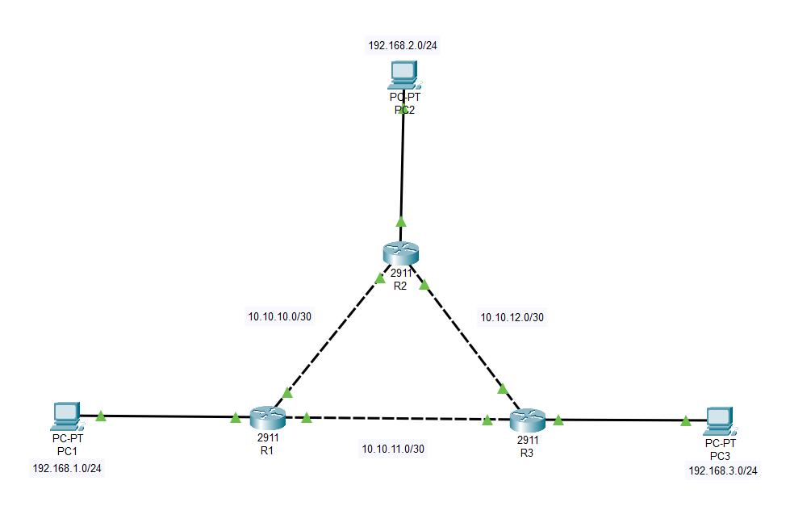

#### Настройка IP-адресации на ПК и маршрутизаторах
```bash 
# Сконфигурировать IP-адрес на порт с ПК
Router(config) interface gigabitEthernet 0/2
Router(config) ip address 192.168.1.1 255.255.255.0
Router(config) no shutdown

# Сконфигурировать IP-адрес на R2
Router(config) interface gigabitEthernet 0/0
Router(config) ip address 10.10.10.1 255.255.255.252
Router(config) no shutdown

# Сконфигурировать IP-адрес на R2
Router(config) interface gigabitEthernet 0/1
Router(config) ip address 10.10.11.1 255.255.255.252
Router(config) no shutdown
```
- Аналогично настроить R2 и R3
# Резальтаты конфигурации маршрутизаторов
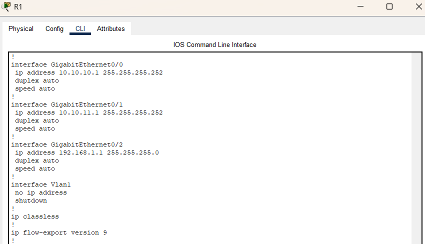
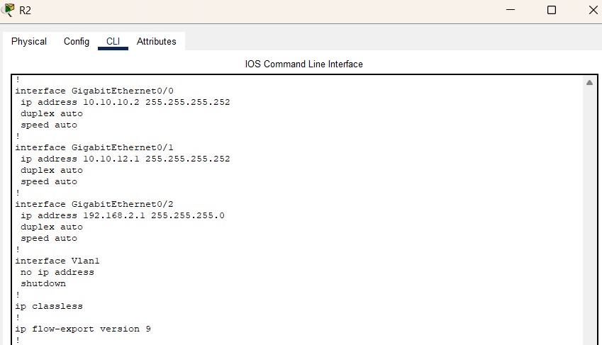


#### Настройка OSPF(пример на R1)

- Настроить конфигурацию маршрутизатора R1
```bash
# Настроить IP-адрес на loopback интерфейсе
Router(config) interface loopback 0
Router(config-if) ip address 192.168.100.1 255.255.255.255
Router(config-if) no shutdown 

# Настроить OSPF
Router(config) router ospf 1
Router(config-router) network 192.168.1.0 0.0.0.255 area 0
Router(config-router) network 10.10.10.0 0.0.0.3 area 0
Router(config-router) network 10.10.11.0 0.0.0.3 area 0
# Указать все сети подключённые к маршрутизатору
```

- Аналогично настроены R2 и R3
- Используются loopback-интерфейсы с маской / 32 для идентификации

**Проверка работы**
- show ip ospf neighbor - отображение соседей OSPF
- show ip route - маршруты с префиксом 0 (OSPF)

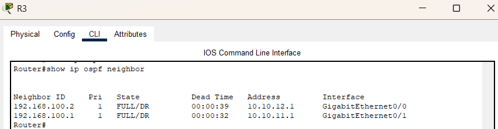
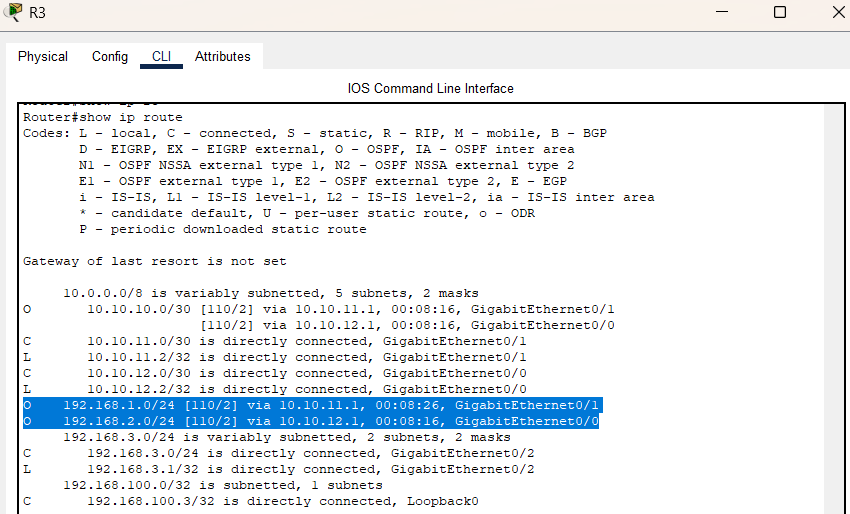

**Проверка отказоустойчивости**
- Отключение одного из линков
- OSPF автоматически перенастраивает маршрут
- Пинг восстанавливается, сеть остаётся доступной

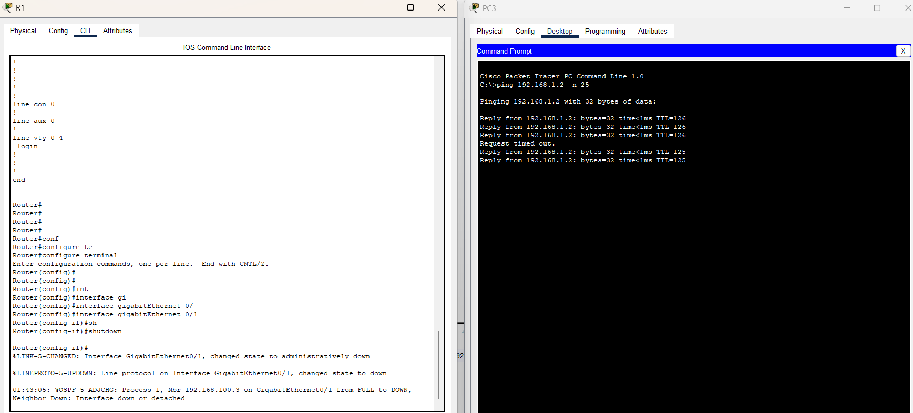
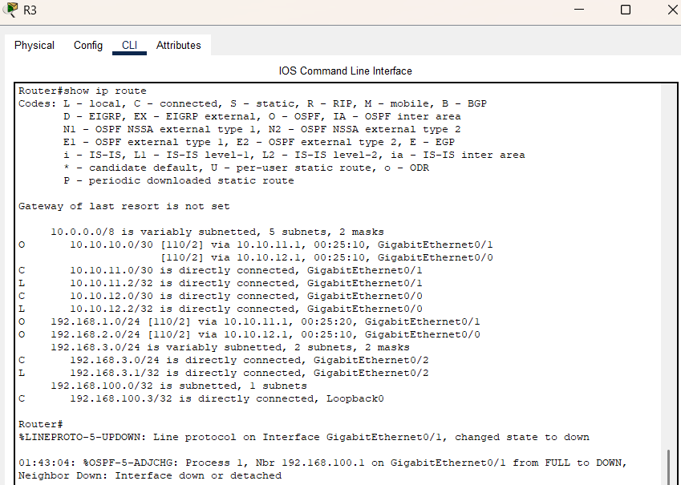
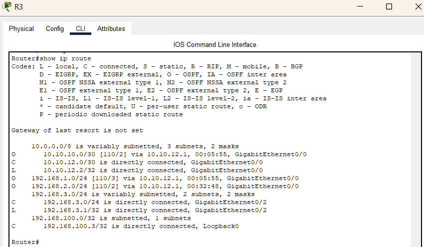

---

### Топология №2

#### Устройства 

- 4х ПК (PC0, PC1, PC2, PC3)
- 2х коммутатор (Switch0, Switch1)
- 2х маршрутизатор 1841 (Router0, Router1)
- 2х маршрутизатор 2911 (Router2, Router3)
- 1х сервер (Server0)

#### Особенности
- Симуляция выхода в интернет через сервер

#### IP-адресация

| Устройство | IP-адрес/Маска | Порт |
|------------|----------------|------|
| R0 | 192.168.1.2/30 | Fa 0/0 |
| R0 | 192.168.10.1/24 | Fa 0/1.10 |
| R0 | 192.168.20.1/24 | Fa 0/1.20 |
| R1 | 192.168.2.2/30 | Fa 0/0 |
| R1 | 192.168.30.1/24 | Fa 0/1.30 |
| R1 | 192.168.40.1/24 | Fa 0/1.40 |
| R2 | 210.214.1.2/30 | Gi 0/0 |
| R2 | 192.168.1.1/30 | Gi 0/1 |
| R2 | 192.168.2.1/30 | Gi 0/2 |
| Internet | 210.214.1.1/30 | Gi 0/1 |
| Internet | 210.214.2.1/30 | Gi 0/0 |
| Server0 | 210.214.2.2/30 | Fa 0/0 |
| PC0 | 192.168.10.2/24 | Fa 0/0|
| PC1 | 192.168.20.2/24 | Fa 0/0|
| PC2 | 192.168.30.2/24 | Fa 0/0|
| PC3 | 192.168.40.2/24 | Fa 0/0|
|----|------------------|------------|
| R0 | 192.168.100.1/32 | loopback 0 |
| R1 | 192.168.100.2/32 | loopback 0 |
| R2 | 192.168.100.3/32 | loopback 0 |


#### Конфигурация OSPF (на Router0)
```bash
Router(config) interface loopback 0
Router(config-if) ip address 192.168.100.1 255.255.255.255

Router(config) router ospf 1
Router(config-router) network 192.168.10.0 0.0.0.255 area 0
Router(config-router) network 192.168.20.0 0.0.0.255 area 0
Router(config-router) network 192.168.1.0 0.0.0.3 area 0
# Аналогичная конфигурация для Router1
```

#### Настройка Router2
```bash
Router(config) interface loopback 0
Router(config-if) ip address 192.168.100.3 255.255.255.255

Router(config) router ospf 1
Router(config-router) network 192.168.1.0 0.0.0.3 area 0
Router(config-router) network 192.168.2.0 0.0.0.3 area 0

# Прописать дефолтный маршрут на Router2
Router(config) ip route 0.0.0.0 0.0.0.0 210.214.1.1

# Показать этот маршрут для Router0 и Router1
Router(config) router ospf 1
Router(config-router) default-information originate 


# Определить внутренние и внешние интерфейсы 
Router(config) interface gigabitEthernet 0/0
Router(config-if) ip nat outside 

Router(config) interface gigabitEthernet 0/1
Router(config-if) ip nat inside 

Router(config) interface gigabitEthernet 0/2
Router(config-if) ip nat inside 
```

#### Настройка NAT
```bash
Router(config) ip access-list standard FOR-NAT
Router(config-std-nacl) permit 192.168.10.0 0.0.0.255
Router(config-std-nacl) permit 192.168.20.0 0.0.0.255
Router(config-std-nacl) permit 192.168.30.0 0.0.0.255
Router(config-std-nacl) permit 192.168.40.0 0.0.0.255

# Использовать PAT
Router(config) ip nat inside source list FOR-NAT interface gigabitEthernet 0/0 overload 
```

**Проверка работы**
- Проверка OSPF соседей Router2
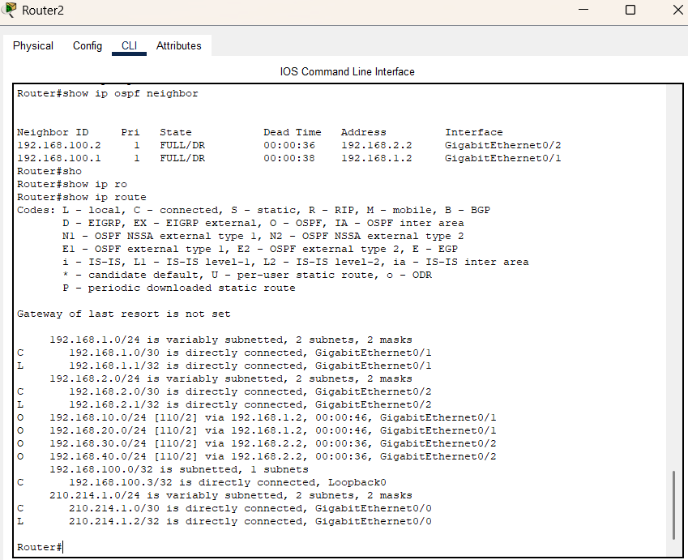

- Проверка пинга с PC0 to PC1,  PC2, PC3


- Таблица маршрутизации Router0
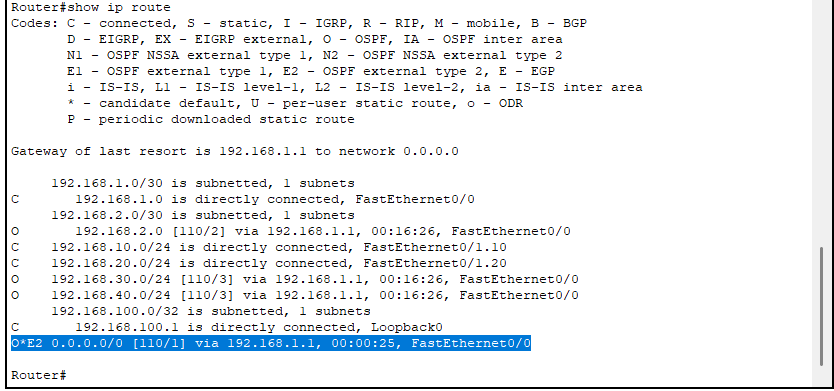

После выполненных действий можно пинговать сеть интернет (её имитацию с помощью маршрутизатора и сервера). Проверить пинг - успешно!
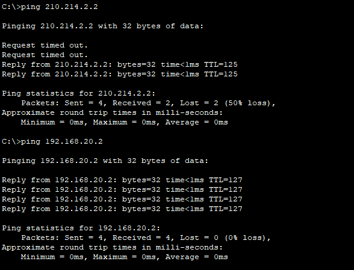

---

## Вывод
- Loopback интерфейсы - хорошая практика для OSPF и идентификации устройств
- Маска /32 используется для loopback IP
- в OSPF network используется wildcard маска (обратная обычной)
- Белые IP (интернет) не должны участвовать в OSPF
- OSPF позволяет быстро восстанавливаться после потери связи

---

## Ошибки
- Не указал шлюзы по умолчанию на ПК - не работал пинг
- Ошибки в encapsulation dot1q - не работали сабинтерфейсы

