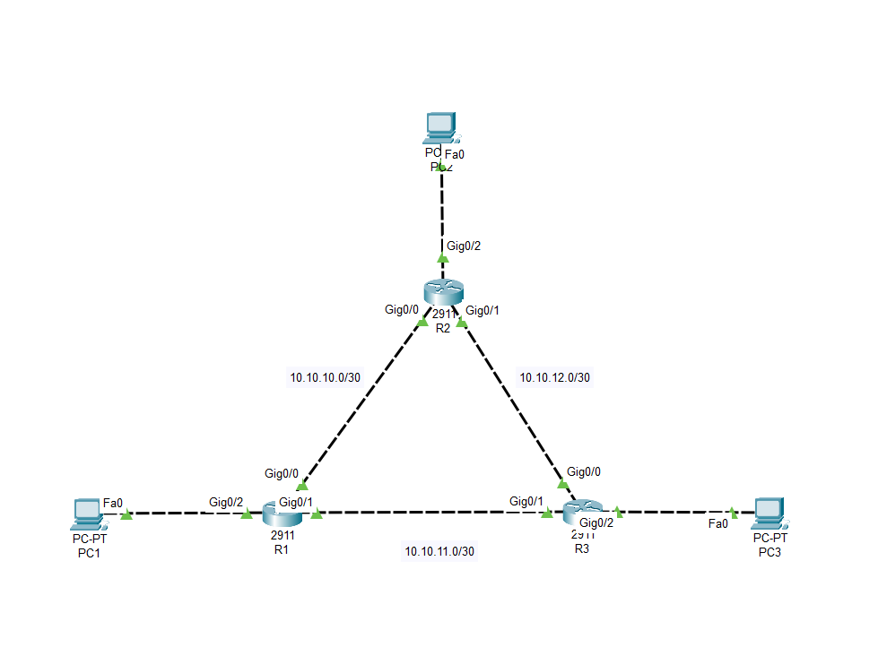
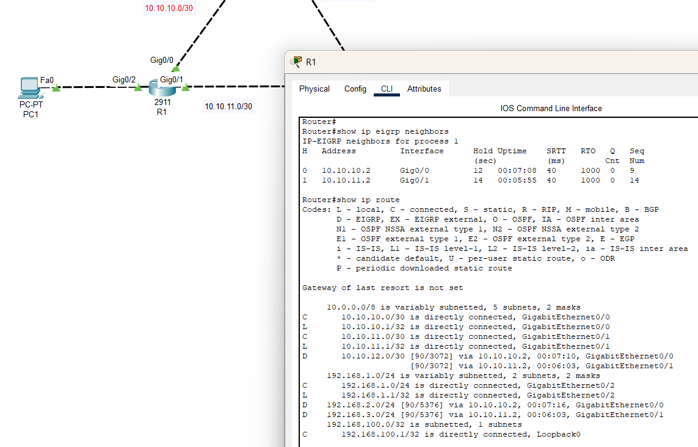
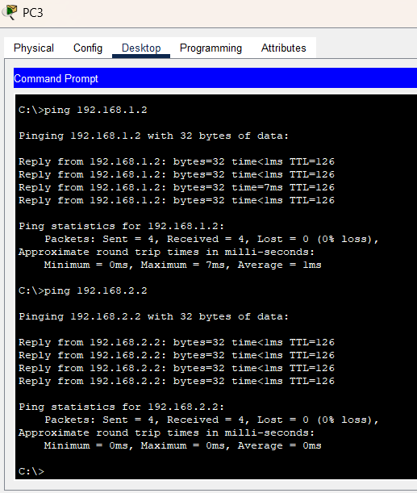
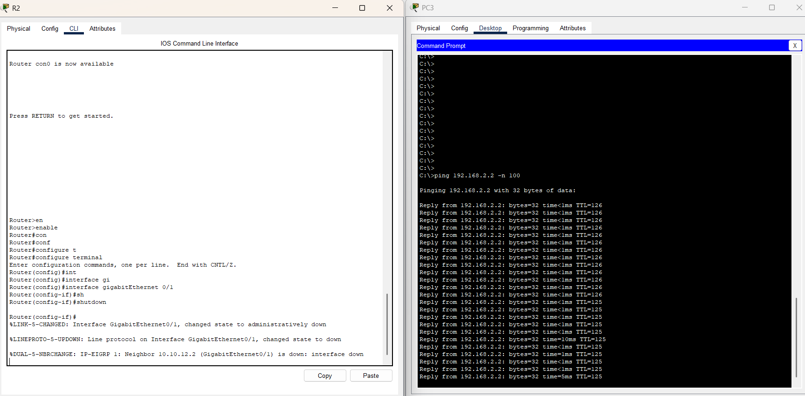
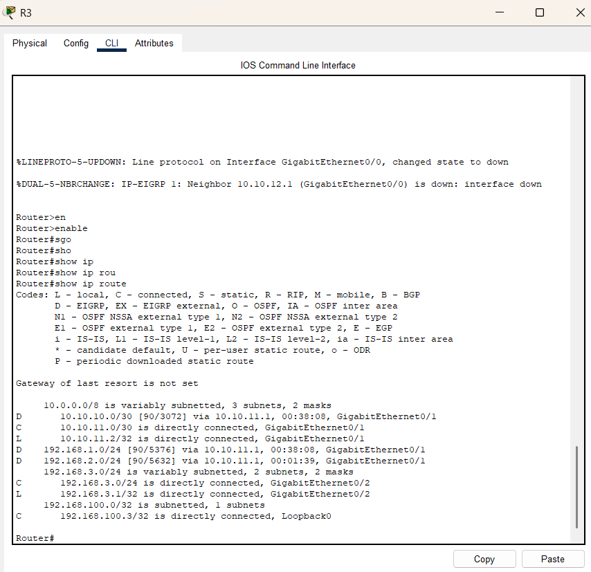
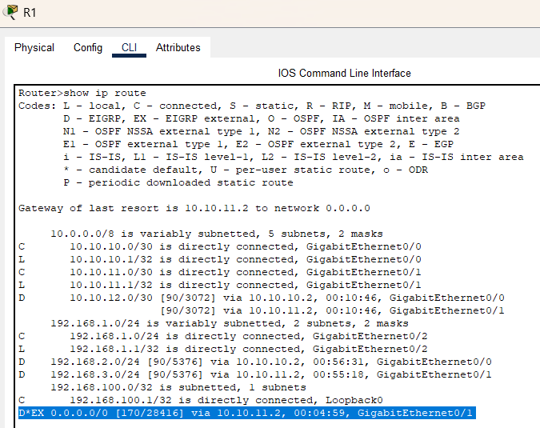
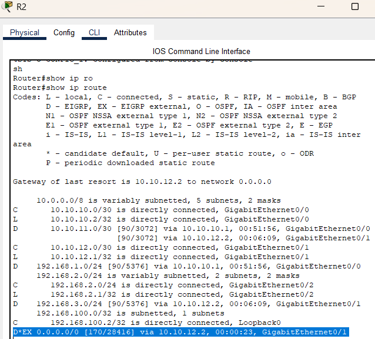

# Урок 14 - Динамическая маршрутизация (EIGRP)

**Дата прохождения:** 01.08.2025

**Видеоурок:** [14.Видео уроки Cisco Packet Tracer. Курс молодого бойца. EIGRP](https://vkvideo.ru/playlist/-32477510_12/video-32477510_456239173)

**Цель урока:** Изучение нового материала

---

## Основные задачи 
- Разобрать понятие динамической маршрутизации
- Ознакомиться с протоколом EIGRP на практике
- Ознакомиться с отличиями EIGRP от OSPF

---

## Теория
- Протоколы динамической маршрутизации делятся на две группы: *внешние и внутренние*
- Внутренние делятся на дистанционно векторные протоколы (EIGRP) и протоколы состояния каналов (OSPF)
- EIGRP - дистанционно векторный протокол (Работает только на оборудовании Cisco)
- При использовании EIGRP делится таблица маршрутизации, маршрутизатор знает только соседей. Это даёт меньшую нагрузку чем у OSPF

### Преимущества и недостатки EIGRP

**Плюсы:**
- Быстрая сходимость
- Поддержка VLSM и CIDR
- Простота конфигурации (по сравнению с OSPF)
- Использует DUAL (Diffusing Update Algorithm) - безопасный и эффективный алгоритм выбора маршрутов

**Минусы:**
- Проприетарный (только Cisco)
- Меньше документации и поддержки, чем у OSPF

---

## Практика

### Топология №1

#### Устройства
- 3х - ПК (PC1, PC2, PC3)
- 3х - Маршрутизатора 2911 (R1, R2, R3)

#### IP-адресация
| Устройство | IP-адрес/Маска | Порт |
| PC1 | 192.168.1.2/24 | Fa 0/0 |
| PC2 | 192.168.2.2/24 | Fa 0/0 |
| PC3 | 192.168.3.2/24 | Fa 0/0 |
| R1 | 10.10.10.1/30 | Gi 0/0 |
| R1 | 10.10.11.1/30 | Gi 0/1 |
| R1 | 192.168.1.1/24 | Gi 0/2 |
| R1 | 192.168.100.1/32 | Lo 0 |
| R2 | 10.10.10.2/30 | Gi 0/0 |
| R2 | 10.10.12.1/30 | Gi 0/1 |
| R2 | 192.168.2.1/24 | Gi 0/2 |
| R2 | 192.168.100.2/32 | Lo 0 |
| R3 | 10.10.12.2/30 | Gi 0/0 |
| R3 | 10.10.11.2/30 | Gi 0/1 |
| R3 | 192.168.3.1/24 | Gi 0/2 |
| R3 | 192.168.100.3 | Lo 0 | 



#### Настройка EIGRP
```bash
# Создать loopback интерфейсы на маршрутизаторах 
Router(config) interface loopback 0
Router(config-if) ip address 192.168.100.1 255.255.255.255
Router(config-if) no shutdown

# Указать сети в EIGRP
Router(config) router eigrp 1
Router(config-router) network 192.168.1.0 0.0.0.255
Router(config-router) network 10.10.10.0 0.0.0.3
Router(config-router) network 10.10.11.0 0.0.0.3
Router(config-router) no auto-summary 

# Аналогично для R2
Router(config) router eigrp 1
Router(config-router) network 192.168.2.0 0.0.0.255
Router(config-router) network 10.10.10.0 0.0.0.3
Router(config-router) network 10.10.12.0 0.0.0.3
Router(config-router) no auto-summary 

# Аналогично для R3
Router(config)#router eigrp 1
Router(config-router) network 192.168.3.0 0.0.0.255
Router(config-router) network 10.10.12.0 0.0.0.3
Router(config-router) network 10.10.11.0 0.0.0.3
Router(config-router) no auto-summary 
```
- no auto-summary - отключает автоматическую агрегацию маршрутов по границам классов (Classful). Это необходимо при исопльзовании VLSM, чтобы не терялись маршруты

#### Проверить наличие соседей
```bash
Router show ip eigrp neighbors 

# Проверить таблицу маршрутизации
Router show ip route
```

- Буквой "D" - обозначается протокол EIGRP

# Проверить пинг между компьютерами


# Проверить отказоустойчивость 
- Одновременно запустить пинг с PC3 to PC2
- Погасить линк на R2 между ним и R3




# Проверить таблицу маршрутизации
- R2 теперь доступен через сети 10.10.11.0 -> 10.10.10.0


# Настроить дефолтный маршрут для R3 и поделиться им с остальными
```bash
Router(config) ip route 0.0.0.0 0.0.0.0 192.168.3.2
Router(config) router eigrp 1
Router(config-router) redistribute static 
```
# Проверить результаты
- Маршрут добавлен на R2 и R1





---

## Вывод
- EIGRP интересный протокол, но работает только с оборудованием Cisco. Следует понимать для чего он нужен и как глубоко его изучать
- EIGRP - мощный динамический протокол маршрутизации, разработанный Cisco. Поддерживает быструю сходимость и простую настройку.
- Отличается от OSPF тем, что использует другой алгоритм (DUAL) и принцип работы (расчёт маршрутов на основе соседей, а не всей топологии). 
- Подходит для небольших и средних корпоративных сетей, где используется только Cisco-оборудование.
- На практике показал высокую устойчивость к отказам (маршруты пересчитывались автоматически).