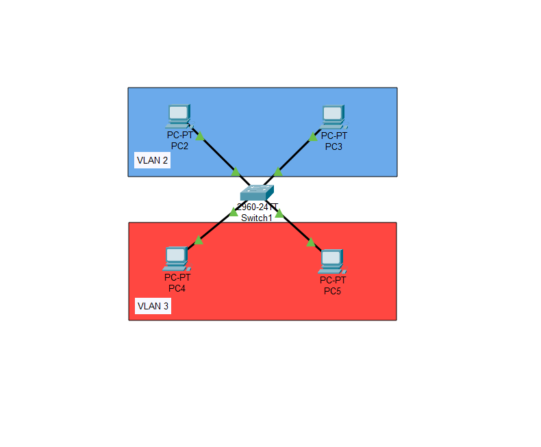
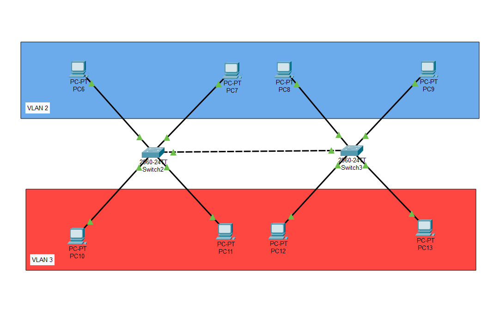

# Урок 5 - Virtual Local Area Networ

**Дата:** 24.06.2025

**Видеоурок:** [5.Видео уроки Cisco Packet Tracer. Курс молодого бойца. VLAN](https://vkvideo.ru/video-32477510_456239182?t=21s)

**Цель урока:** Повторение ранее изученного материала

---

## Основные задачи: 
1.**Применение VLAN с одним коммутатором**
2.**Применение VLAN с двумя коммутаторами**
3.**Практика с access и trunk портами**

---

## Выполнение:
1. Создать VLAN -> Определить Access-порты
2. Создать VLAN -> Определить Access-порты -> Определить Trunk-порты
---

## Теория:
- VLAN (Virtual Local Network) - Виртуальная локальная компьютерная сеть - группа хостов с общим набором требований, которые взаимодействуют так, будто подключены к широковещательному домену независимо от их физического местонахождения.
- Позволяет:
 - Разделить сеть на логические сегменты
 - Изолировать трафик и повысить безопасность
 - Уменьшить широковещательный трафик
- Access-port - порт подключения конечного устройства. Доступен только для VLAN
- Trunk-port - порт между коммутаторами. Передаёт трафик нескольких VLAN
- Настройка VLAN возможна только на **управляемых** коммутаторах (консоль, Telnet, SSH, web-интерфейс)

---

## Работа в CPT (Cisco Packet Tracer):

### VLAN c одним коммутатором

1. Размещение:
- Switch1
- 4 PC: PC2-PC5 (соединены прямыми кабелями)

2. Создание VLAN:
```bash
Switch(config)# vlan 2
Switch(config)# name VLAN2

Switch(config)# vlan 3
Switch(config)# name VLAN3
```

3. Назначение Access-портов:
- VLAN 2: FastEthernet 0/1-2
- VLAN 3: FastEthernet 0/3-4

4. Команды: 
```bash
Switch(config)# interface range fastethernet 0/1-2
Switch(config)# switchport mode access
Switch(config)# switchport access vlan 2

Switch(config)# interface range fastethernet 0/3-4
Switch(config)# switchport mode access
Switch(config)# switchport access vlan 3
```

5. Назначение IP-адресов: 
- PC2 - 192.168.0.2 
- PC3 - 192.168.0.3 
- PC4 - 192.168.0.4 
- PC5 - 192.168.0.5 

6. Проверка:
```bash
Switch# show vlan brief
```

7. Проверка ping:
- PC2 -> PC3 - успешно
- PC4 -> PC5 - успешно



---

### VLAN с двумя коммутаторами

1. Размещение
- Switch2, Switch3
- 8 PC: PC6-PC13

2. VLAN
- vlan 2 - PC 6,7,8,9
- vlan 3 - PC 10,11,12,13

3. Конфигурация Access-портов:
```bash
Switch(config)# interface range fa0/1-2
Switch(config)# switchport mode access
Switch(config)# switchport access vlan 2

Switch(config)# interface range fa0/3-4
Switch(config)# switchport mode access
Switch(config)# switchport access vlan 2
```

4. Настройка trunk-портов (между Switch2 и Switch3):

```bash
Switch(config)# interface gigabitethernet 0/1
Switch(config)# switchport mode trunk
Switch(config)# switchport trunk allowed vlan 2,3
```

5. Проверка ping
- PC6 -> PC9 
- PC10 -> PC13
!ответы получены



---

##  Заключения 
- Очень удобно заранее планировать IP-адресацию: помогает при конфигурации и проверке
- Access-порт работает только с одним VLAN - если устройство из другого VLAN, передача невозможна
- Чтобы получить доступ к VLAN через access-порт - он должен быть привязан именно к нужному VLAN
- Trunk-порт позволяет "упаковать" несколько VLAN и передавать их по одному физическому кабелю между коммутаторами

---

## Вывод
VLAN - это не просто группировка устройств. Это мощный интсрумент логической изоляции и управления трафиком. 
Работа с VLAN - первый шаг к структурной, масштабируемой и безопасной сети.

---

[Вернуться в начало](../README.md)