# Урок 6 - Устранение петель с помощью протокола STP

**Дата:** 24.06.2025

**Видеоурок:** [6.Видео уроки Cisco Packet Tracer. Курс молодого бойца. STP](https://vkvideo.ru/playlist/-32477510_12/video-32477510_456239181)

**Цель урока:** Повторение ранее изученного материала

---

## Основные задачи:
1. Ознакомиться с работой протоколов STP, RSTP
2. Ознакомиться с состояниями портов в STP

---

## Теория:
- **STP(Spanning Tree Protocol)** - протокол, устраняющий петли в L2-сети
- **RSTP(Rapid STP)** - улучшенная версия STP, с ускоренной сводимостью
- Используются при резервировании линков для отказоустойчивости
Состояния портов:
- Блокировка (blocking)
- Прослушивание (listening)
- Обучение (learning)
- Передача (forwarding)

---

## Практика в Cisco Packet Tracer

### Пример работы протокола STP с коммутаторами

1.**Размещение** Switch0, Switch1, Switch2 соединены топологией кольцо.
- Начинает работу протокол STP
- Определяется корневой коммутатор согласно параметрам
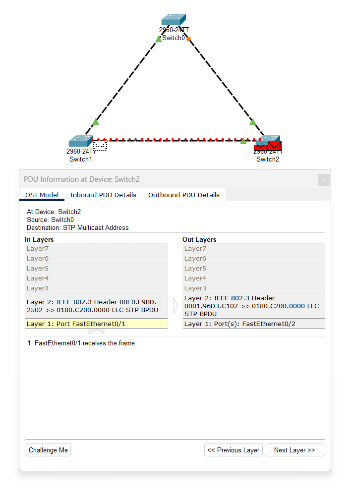

2.Определение Root bridge
```bash
Switch# show spanning-tree
```
**Корневой коммутатор - Switch0**
- У корневого коммутатора в конфиге написано "This bridge is the root"**
- У этого коммутатора все порты назначены (Desg) и в режиме пeредачи (FWD)
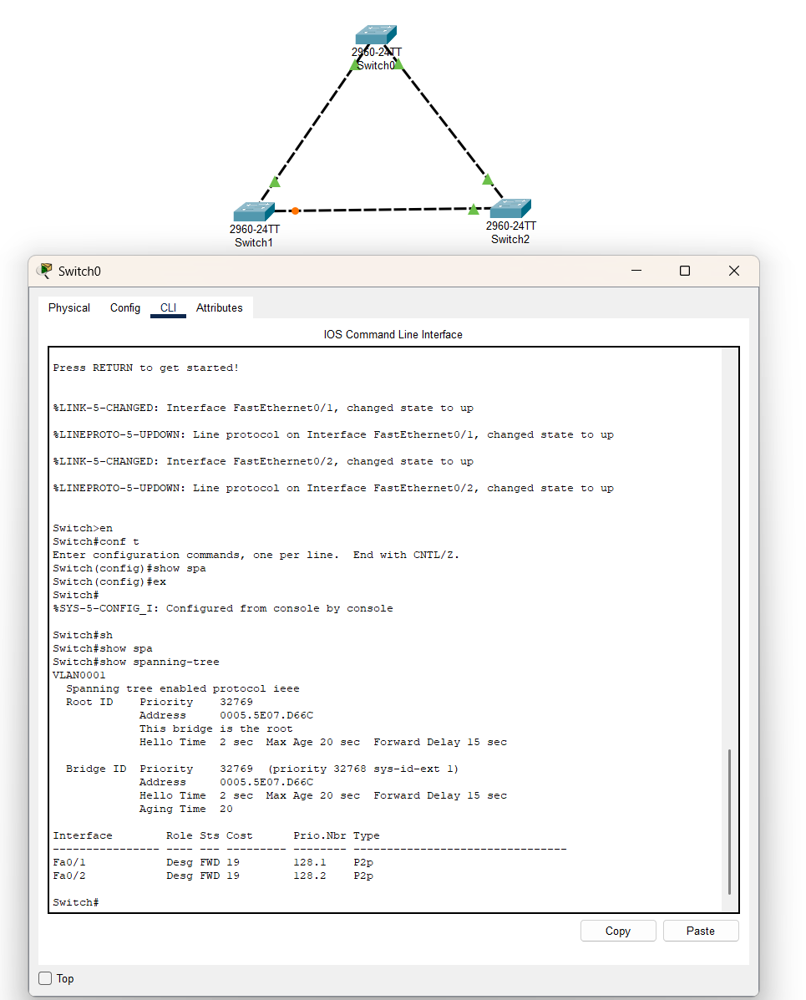

3.Проверить конфигурации остальных коммутаторов
```bash
Switch# show spanning-tree
```
**Switch2**
- Fa0/1 порт который ближе к корневому свитчу - корневой root
- Fa0/2 порт - назначенный desg
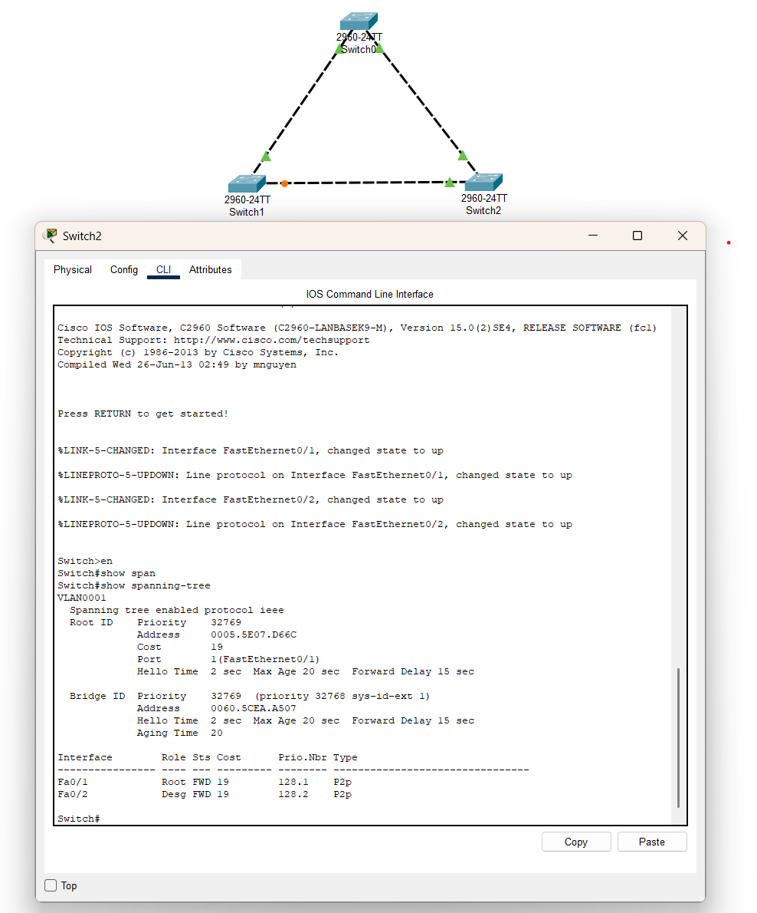

**Switch1**
- Fa0/1 порт который ближе к корневому - root
- Fa0/2 порт заблокирован - на данный сегмент уже есть назначенный порт
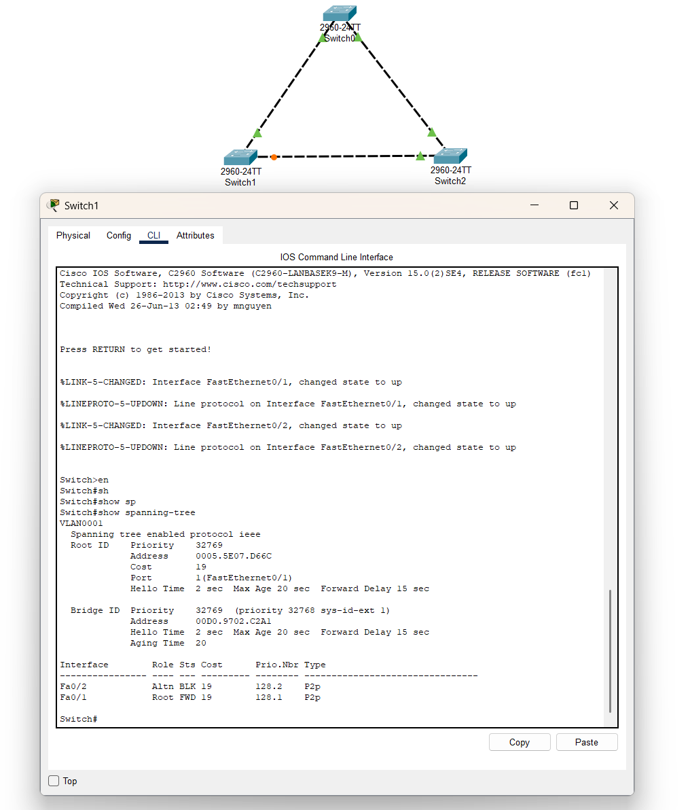

4. Чтобы проверить работу протокола STP нужно выключить порт Fa0/1 на Switch2
```bash 
Switch(config)# interface fa0/1
Switch(config)# shutdown
```


В это время начал свою работу порт Fa0/2 на switch 1
- Перешёл в режим обучения (LRN)
- Перешёл в режим передачи (FWD)

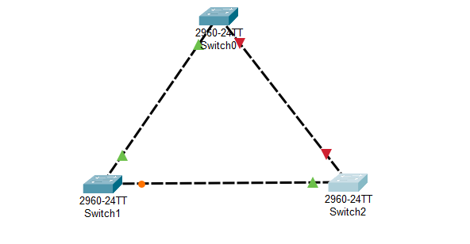

---

## Пример работы протокола RSTP с коммутаторами и хостами

1. Разместить Switch0-1 и PC0-1
- Протокол STP работает с коммутационной петлёй
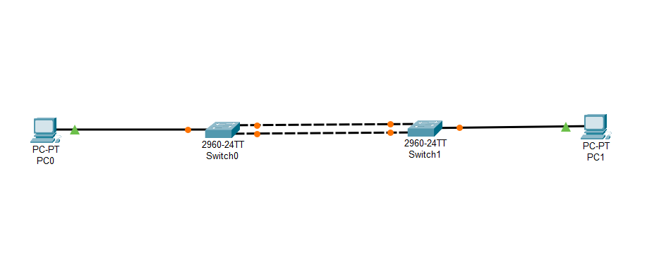

2. Настроить IP-адресацию на PC0-PC1 и проверить ping
- PC0: 192.168.1.1 255.255.255.0
- PC1: 192.168.1.2 255.255.255.0

ping PC0 to PC1:
```bash
ping 192.168.1.2
```
>Reply from 192.168.1.2 byte=32 time=9ms TTL128

>Reply from 192.168.1.2 byte=32 time<1ms TTL128

3.Проверить конфигурацию портов на коммутаторах
```bash
Switch# show spanning-tree
```

Switch0:
- Fa0/3 Altn BLK
- Fa0/2 Desg FWD
- Fa0/1 Root FWD

Switch1:
- Fa0/3 Desg FWD
- Fa0/2 Desg FWD
- Fa0/1 Desg FWD

4. Гасим порт Fa0/1 на Switch1 и наблюдаем
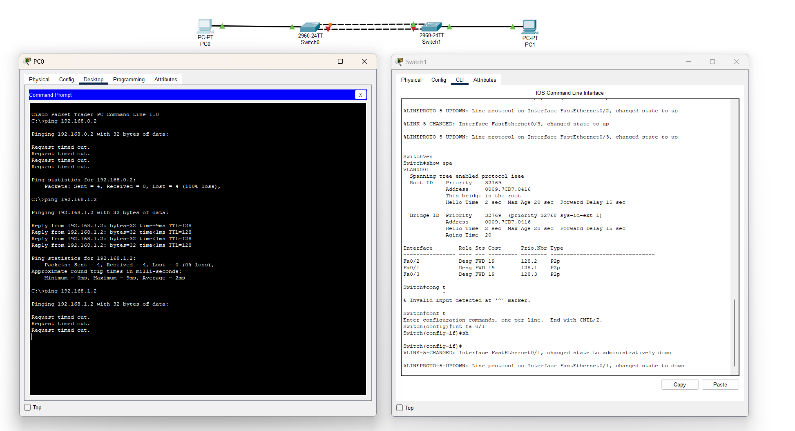
- Некоторое время Fa0/3 на Switch 1 находится в режиме LRN
- Связь восстанавливается только после перехода Fa0/3 в режим FWD
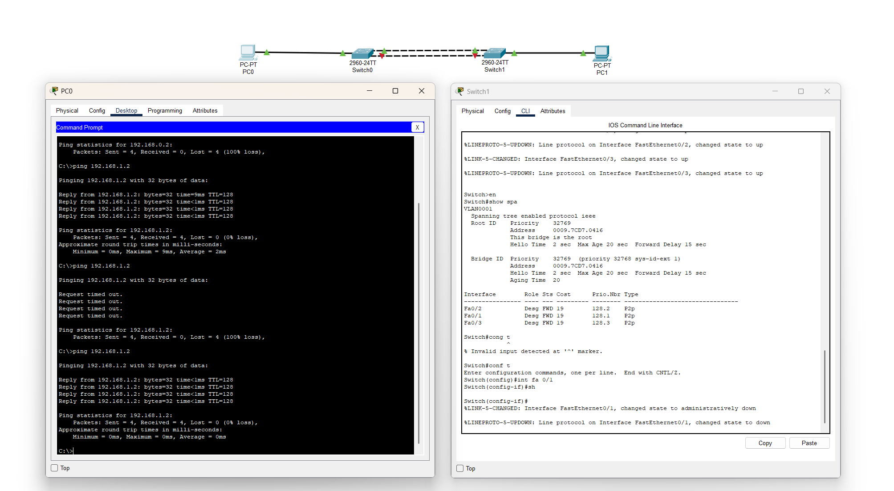

5. Подключение RSTP на Switch1 и Switch2
```bash
Switch(config)# spanning-tree mode rapid-pvst
```

6. Проверить включён-ли протокол RSTP
```bash
Switch# show spanning-tree
```
В конфигурации должна быть строка "Spanning tree enabled protocol rstp"
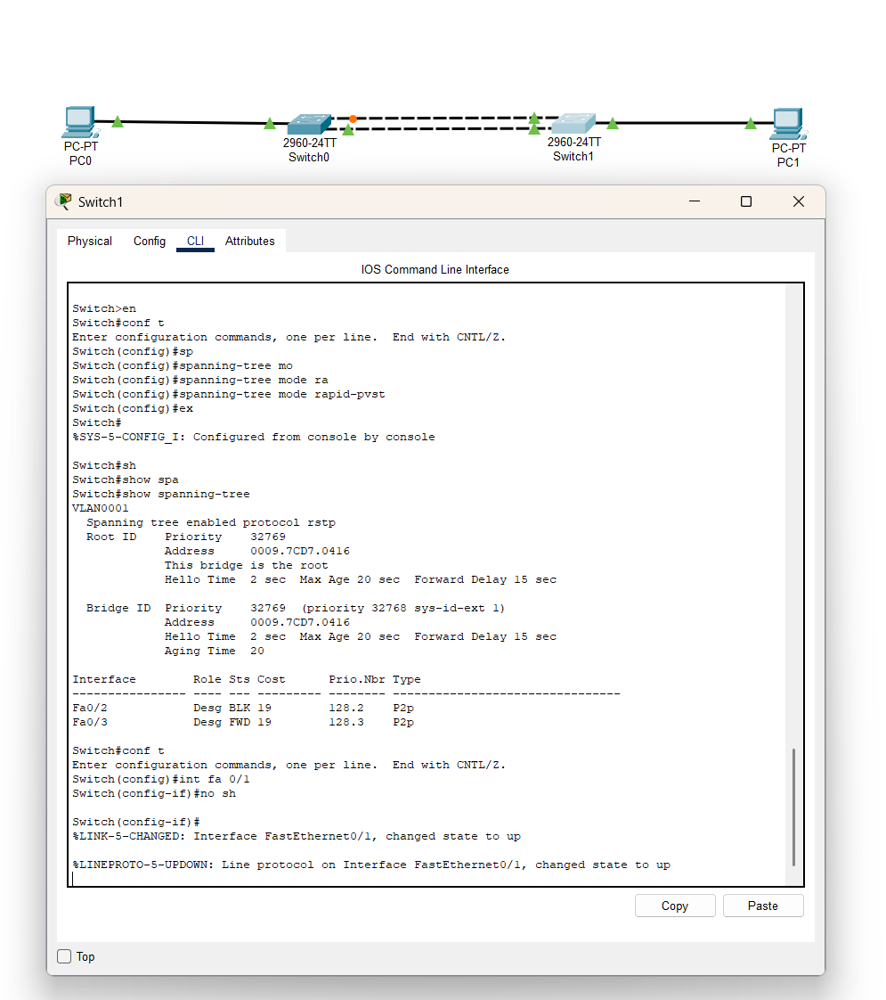

7. Заускаем ping и гасим Switch1 - Fa0/3
Дивимся результатам работы RSTP!
При одновременном выполнении команды ping на PC0 и shutdown на Switch1 не было задержек или потери данных
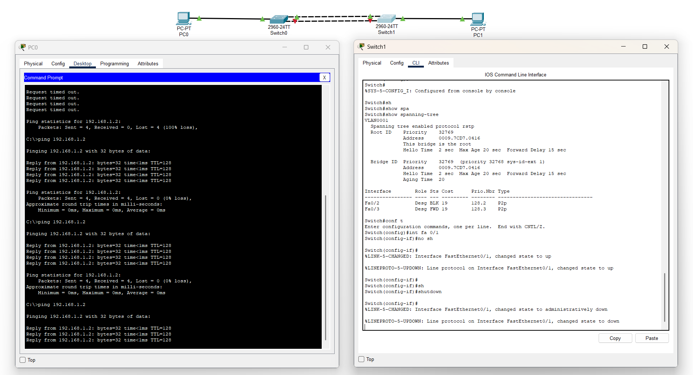
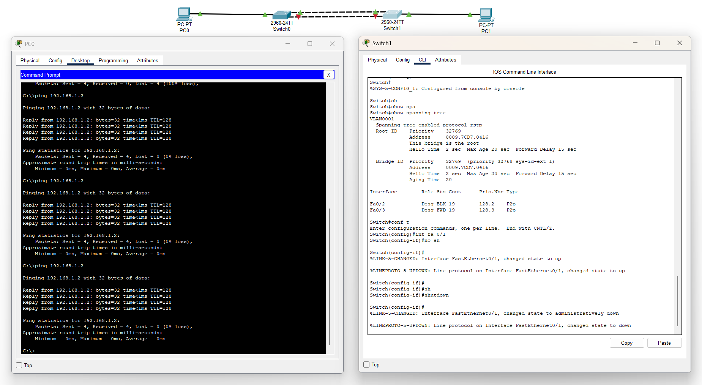

## Вывод:
- Организация отказоустойчивой сети нужна для возможности быстро восстановить работу сети в случае если возникнет какая-либо проблема
- Резервирование соединения (традиционная избыточная топология) - метод организации отказоустойчивых каналов связи
 - При использовании двух линков, один активно работает, а второй находится в резерве
 - Когда первый канал упадёт - второй вступит в работу
 - Резервирование соединений приводит к коммутационным петлям (приводит к широковещательным штормам, множественным кадрам и петлям)
- Spanning Tree Protocol (STP - Протокол связующего дерева) - это протокол который реализует защиту от петель в сети, резервирует каналы, работате на 2-ом уровне модели OSI. Время сводимости 30-50 сек.
- PVST - расшифровывается per vlan spanning-tree

