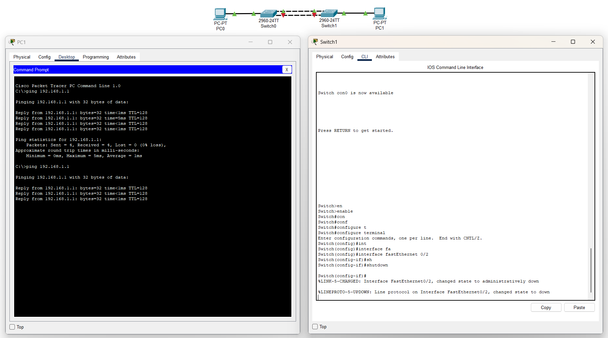
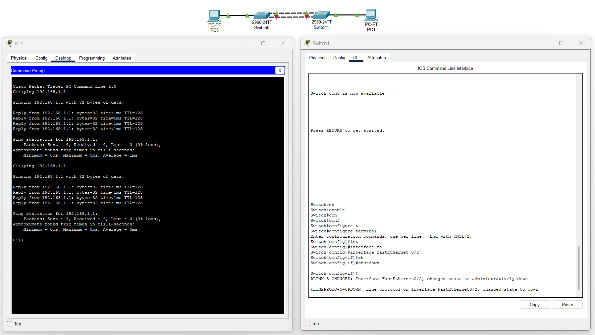
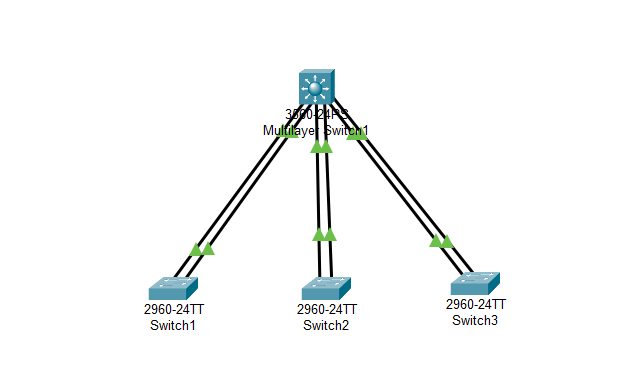

# Урок 7 - Агрегирование каналов - Протокол EtherChannel

**Дата:** 24.06.2025

**Видеоурок:** [7.Видео уроки Cisco Packet Tracer. Курс молодого бойца. EtherChannel](https://vkvideo.ru/playlist/-32477510_12/video-32477510_456239180)

**Цель урока:** Повторение ранее изученного материала

---

## Основные задачи:
- Освоить настройку агрегированных каналов между коммутаторами (EtherChannel)
- Изучить работу протокола LACP
- Реализовать топологию с отказоустойчивым логическим каналом
- Проверить поведение сети при отказе одного из физических линков

---

## Теория:

- **EtherChannel** - технология объединения нескольких физических интерфейсов в один логический канал для увеличения пропускной способности и отказоустойчивости.
- Используются все каналы одновременно (load balancing).
- При обрыве одного из линков трафик перенаправляется по оставшимся.
- Протоколы агрегации:
  - LACP (IEEE 802.3ad) - открытый стандарт, педпочтителен.
  - PAgP - протокол Cisco

**Требования к интерфейсам EtherChannel:**
- одинаковая скорость (speed)
- режим дуплекса (duplex mode)
- trunk/native VLAN
- одинаковый тип интерфейса

---

## Практика

**Статическое агрегирование**

**Топология:**

- Устройства: Switch0, Switch1, PC0, PC1
- Соединения между Switch0 и PC0: Fa0/1 - Fa0/3
- Соединения между Switch1 и PC1: Fa0/1 - Fa0/3
- Порты свитчей Fa0/1-2 будут объединены в агрегированный канал

**Конфигурация:**

- Прописать IP-адресацию на PC
  - PC0: 192.168.1.1 255.255.255.0
  - PC1: 192.168.1.2 255.255.255.0

- Соединить свитчи линками
```bash
Switch(config)# interface range fastethernet 0/1-2
Switch(config-if-range)# channel-group 1 mode on
```
- Проверить соединение
Ping PC0 to PC1
```bash
ping 192.168.1.2
# Успешный ответ
```


**Тест отказоустойчивости**

- Потушить линк Fa0/2 на Switch1 
- Одновременно сделать ping PC1 to PC0
```bash
Switch(config)# interface fastethernet 0/2
Switch(config-if)# shutdown
```

- ping прошёл успешно - подтверждена отказоустойчивость агрегированного канала



**Логически завершить работу и обратно поднять линк на Switch2**
```bash
Switch(config)# interface fastethernet 0/2
Switch(config-if)# no shutdown
```

6.Создать Trunk-port
На Switch1 и Switch2
```bash
Switch(config)# interface port-channel 1
Switch(config-if)# switchport mode trunk
```
---

**Динамическое агрегирование**

**Топология** 
- L3 в центре
- L2 Switch1, Switch2, Switch3 по краям (звезда)

**Настройка конфигураций L3 коммутатора**

Конфигурируем агрегированные каналы
- Switch1 - Fa0/1-2
- Switch2 - Fa0/3-4
- Switch3 - Fa0/5-6

```bash
#Первый агрегированный канал
Switch(config)# interface range fastethernet fa0/1-2
Switch(config-if-range)# channel-protocol lacp
Switch(config-if-range)# channel-group 1 mode active

#Второй агрегированный канал
Switch(config)# interface range fastethernet fa0/3-4
Switch(config-if-range)# channel-protocol lacp
Switch(config-if-range)# channel-group 2 mode active

#Третий агрегированный канал
Switch(config)# interface range fastethernet fa0/5-6
Switch(config-if-range)# channel-protocol lacp
Switch(config-if-range)# channel-group 3 mode active
```

**Конфигурация L2-коммутаторов**

# Конфигурирование Switch1
```bash
Switch(config)# interface range fastethernet fa0/1-2
Switch(config-if-range)# channel-protocol lacp
Switch(config-if-range)# channel-group 1 mode passive
```

- Повторить аналогично для остальных L2-коммутаторов, указав соответствующий номер channel-group
  - Switch2 - channel-group 2
  - Switch3 - channel-group 3

**Проверить статус etherchannel-port**
```bash
Switch>show etherchannel
Switch>show etherchannel summary
Switch>show etherchannel port-channel
```

**Соединить L2 Switch's и L3 Switch**
- Switch1 Fa0/1 - L3 Switch Fa0/1
- Switch1 Fa0/2 - L3 Switch Fa0/2
- Switch2 Fa0/1 - L3 Switch Fa0/3
- Switch2 Fa0/2 - L3 Switch Fa0/4
- Switch3 Fa0/1 - L3 Switch Fa0/5
- Switch4 Fa0/2 - L3 Switch Fa0/6

## Вывод:
- EtherChannel увеличивает пропускную способность и даёт отказоустойчивость.
- LACP предпочтительнее, чем статический режим.
- Mode active + mode passive = корректная динамическая настройка.
- При ошибочной конфигурации - срабатывает STP, блокирую один из линков.
- **channel-group номедла должны быть уникальны для каждого логического канала на устройстве.***

## Работа над ошибками
- Ошибка: на Switch2 и Switch3 исопльзовался одинаковый номер channel-group = привело к блокировке линка STP.

- Решение:
```bash
Switch# show running-config

Switch(config)# interface fastethernet0/3
Switch(config-if)# no channel-protocol
Switch(config-if)# no channel-group
```
-затем перенастройка с уникальными группами.

