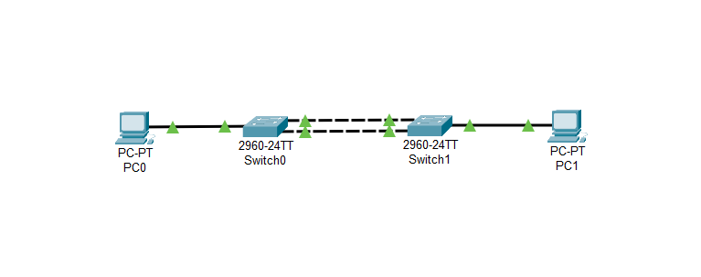
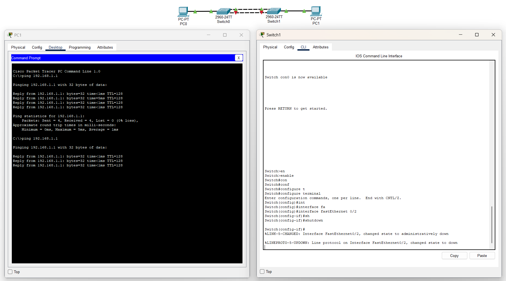
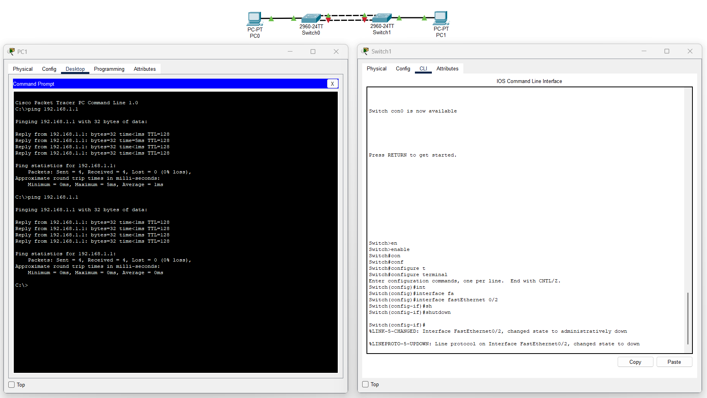

# Урок 7 - Агрегирование каналов - Протокол EtherChannel

**Дата:** 24.06.2025

**Видеоурок:** [7.Видео уроки Cisco Packet Tracer. Курс молодого бойца. EtherChannel](https://vkvideo.ru/playlist/-32477510_12/video-32477510_456239180)

**Цель урока:** Повторение ранее изученного материала

---

## Основные задачи:

---

## Теория:
- Агрегирование каналов - метод организации отказоустойчивых каналов
- Протокол EtherChannel - объединяет несколько физических каналов в один логический
 - Если используются два физических канала между коммутаторами - они буду логически восприниматься как один
 - В случае обрыва одного из линков передача информации не прекратится
- Все соединения агрегированного канала активные и передают информацию - это повышает пропускную способность канала
- LACP (link Aggregation Control Protocol) 

**Для агрегирования каналы должны иметь одинаковые параметры:**
- скорость (speed)
- режим дуплекса (duplex mode)
- native VLAN
- диапазон разрешенных VLAN
- trunking status
- тип интерфейса

---

## Практика

**Статическое агрегирование**

1. **Размещение**

- Разместить Switch0 и Switch1, PC0 и PC1
  - PC0 и Switch0 соединяем на Fa0/1 - Fa0/3
  - PC1 и Switch0 соединяем на Fa0/1 - Fa0/3

Порты Fa0/1-2 будут объединены в агрегированный канал

2. **Настройка интерфейсов**
- Настроить интерфейсы прежде чем сделать линки между Switch0 и Switch1
- Создать логические интерфейсы channel-group на свитчах

```bash
Switch(config)# interface range fastethernet 0/1-2
Switch(config-if-range)# channel-group 1 mode on
```

3.Соединение устройств в топологию

- Соединить Switch1 и Switch2
  -Fa0/1 - Fa0/1
  -Fa0/2 - Fa0/2
- Прописать IP-адресацию на PC
  - PC0: 192.168.1.1 255.255.255.0
  - PC1: 192.168.1.2 255.255.255.0
- Проверить соединение
Ping PC0 to PC1
```bash
ping 192.168.1.2
```

>Pinging 192.168.1.2 with 32 bytes of data:

>Reply from 192.168.1.2: bytes=32 time=2ms TTL=128



4.Проверить отказоустойчивость

- Потушить линк Fa0/2 на Switch1 
- Одновременно сделать ping PC1 to PC0
```bash
Switch(config)# interface fastethernet 0/2
Switch(config-if) shutdown
```

ping прошёл без потерь!



5.Логически завершить работу и обратно поднять линк на Switch2
```bash
Switch(config)# interface fastethernet 0/2
Switch(config-if)# no shutdown
```

6.Создать Trunk-port
На Switch1 и Switch2
```bash
Switch(config)# interface port-channel 1
Switch(config-if)# switchport mode trunk
```
---

**Динамическое агрегирование**

1. Размещение
- Разместить L2 Switch1-3 и L3 Switch1
- Сделать топологию "звезда"

2.Настройка конфигураций L3 коммутатора

Конфигурируем агрегированные каналы
- Switch1 - Fa0/1-2
- Switch2 - Fa0/3-4
- Switch3 - Fa0/5-6

Первый агрегированный канал
```bash
Switch(config)# interface range fastethernet fa0/1-2
Switch(config-if-range)# channel-protocol lacp
Switch(config-if-range)# channel-group 1 mode active
```

Второй агрегированный канал
```bash
Switch(config)# interface range fastethernet fa0/3-4
Switch(config-if-range)# channel-protocol lacp
Switch(config-if-range)# channel-group 2 mode active
```

Третий агрегированный канал
```bash
Switch(config)# interface range fastethernet fa0/5-6
Switch(config-if-range)# channel-protocol lacp
Switch(config-if-range)# channel-group 3 mode active
```

3.Настроить коммутаторы уровня доступа

Switch1
```bash
Switch(config)# interface range fastethernet fa0/1-2
Switch(config-if-range)# channel-protocol lacp
Switch(config-if-range)# channel-group 1 mode passive
```

Switch2
```bash
Switch(config)# interface range fastethernet fa0/1-2
Switch(config-if-range)# channel-protocol lacp
Switch(config-if-range)# channel-group 2 mode passive
```

Switch3
```bash
Switch(config)# interface range fastethernet fa0/1-2
Switch(config-if-range)# channel-protocol lacp
Switch(config-if-range)# channel-group 3 mode passive
```

4.Проверить статус etherchannel-port
```bash
Switch>show etherchannel
Switch>show etherchannel summary
Switch>show etherchannel port-channel
```

5.Соединить L2 Switch's и L3 Switch
- Switch1 Fa0/1 - L3 Switch Fa0/1
- Switch1 Fa0/2 - L3 Switch Fa0/2
- Switch2 Fa0/1 - L3 Switch Fa0/3
- Switch2 Fa0/2 - L3 Switch Fa0/4
- Switch3 Fa0/1 - L3 Switch Fa0/5
- Switch4 Fa0/2 - L3 Switch Fa0/6

## Вывод:
- Протокол-Pagp - поддерживается только на оборудовании Cisco
- При создании динамического агрегированного канала сначала указать протокол lacp, а потом добавить в channel-group
- Рекомендуется использовать параметр active только с одной стороны линка, на вторую ставить параметр passive

## Работа над ошибками
- Указал на Switch2 и Switch3 port-channel 1. Это привело к тому, что там просто начал работать протокол STP и один линк был полностью Desg, а второй был Desg-Altn
- Убрал полностью соединения L2 свитчей с свитчем L3. Изменил конфигурацию channel-group
- Проверил конфигурацию, полностью убрал старую конфигурацию с помощью команды no
```bash
Switch# show running-config

Switch(config)# interface fastethernet0/3
Switch(config-if)# no channel-protocol
Switch(config-if)# no channel-group
```

