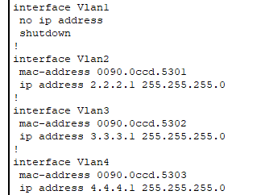
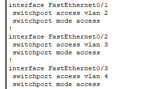
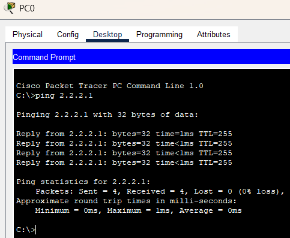
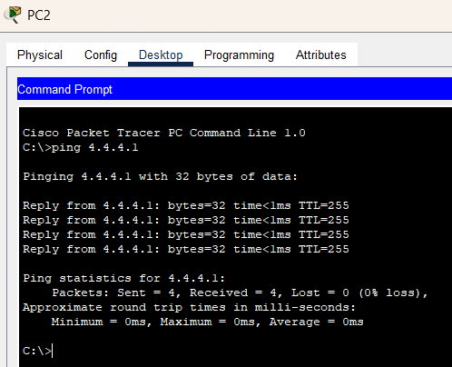
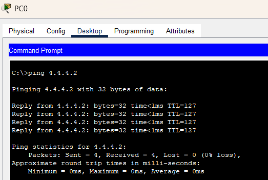
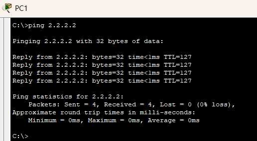
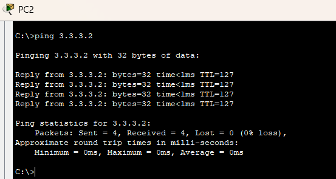
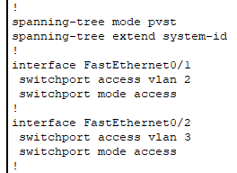
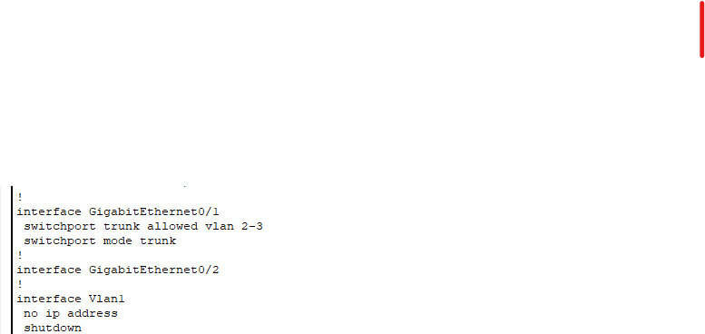
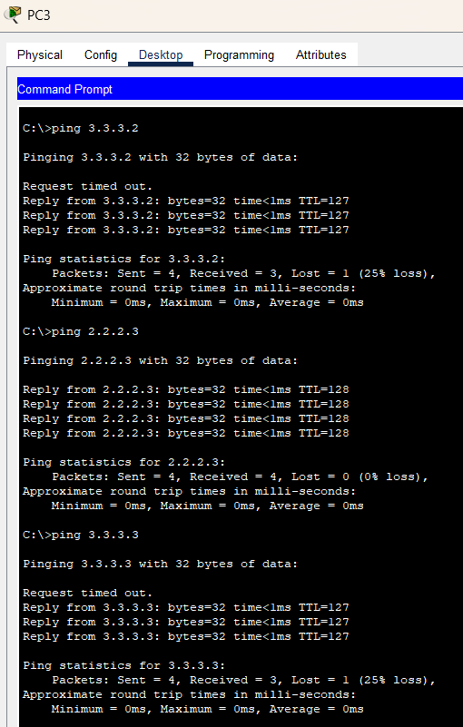

# Урок 8 - Использование коммутатора третьего уровня

**Дата:** 25.06.2025

**Видеоурок:** [8.Видео уроки Cisco Packet Tracer. Курс молодого бойца. L3 коммутатор](https://vkvideo.ru/playlist/-32477510_12/video-32477510_456239179)

**Цель урока:** Повторение ранее изученного материала

---

## Основные задачи 
- Повторение настройки VLAN
- Изучение настройки IP-интерфейсов на L3-коммутаторе
- Настройка trunk-портов
- Реализация межвлановой маршрутизации ('ip routing')
- Проверка связанности между устройствами

---

## Теория
Коммутаторы L3 (третьего уровня):

- Выполняют IP-маршрутизацию между VLAN
- Агрегируют коммутаторы уровня доступа
- Используются на уровне **распределения**
- Обеспечивают высокую пропускную способность

---

## Практика

**Топология**
- 1х L3 Switch
- 3х PC (PC0, PC1, PC2)
- Каждый PC в своей vlan

#### VLAN и IP-настройка

```bash
# Настройка vlan 2 для PC0
Switch(config) vlan 2
Switch(config-if) name VLAN2
Switch(config) interface fastethernet 0/1
Switch(config) switchport mode access
Switch(config) switchport access vlan 2

# Аналогично: VLAN 3 и VLAN 4 для других портов
```

- Интерфейсы VLAN на L3 Switch
```bash
# IP-настройка VLAN-интерфейсов
Switch(config) interface vlan 2
Switch(config-if) ip address 2.2.2.1 255.255.255.0
Switch(config-if) no shutdown

Switch(config) interface vlan 3
Switch(config-if) ip address 3.3.3.1 255.255.255.0
Switch(config-if) no shutdown

Switch(config) interface vlan 4
Switch(config-if) ip address 4.4.4.1 255.255.255.0
Switch(config-if) no shutdown
```

- Конфигурация ПК
  - PC0 - IP 2.2.2.2  -  mask 255.255.255.0 - gate 2.2.2.1 - vlan 2 
  - PC1 - IP 3.3.3.3  -  mask 255.255.255.0 - gate 3.3.3.1 - vlan 3 
  - PC2 - IP 4.4.4.4  -  mask 255.255.255.0 - gate 4.4.4.1 - vlan 4 

- Проверить результаты конфигурации



- Проверить свзяь




- Включение маршрутизации
```bash
# L3 Switch config:
Switch(config) ip routing
```
- Проверка связности




---

**Расширенная топология (с L2 коммутаторами)**

**Топология**
- 1х L3 Switch
- 2х L2 Switch (Switch0, Switch1)
- 4x PC (PC3 - PC6), подключенные по 2 к каждому L2
  - PC3 - Switch0 - Fa0/1 - vlan 2 - IP 2.2.2.2 255.255.255.0 - gate 2.2.2.1
  - PC4 - Switch0 - Fa0/2 - vlan 3 - IP 3.3.3.2 255.255.255.0 - gate 3.3.3.1
  - PC5 - Switch1 - Fa0/1 - vlan 2 - IP 2.2.2.3 255.255.255.0 - gate 2.2.2.1
  - PC6 - Switch1 - Fa0/2 - vlan 3 - IP 3.3.3.3 255.255.255.0 - gate 3.3.3.1

**Конфигурация**
- Определить PC в vlan согласно топологии
```bash
# Создзание vlan 2
Switch(config) vlan 2
Switch(config-vlan) name VLAN2

# Назначение портов
Switch(config) interface fastethernet 0/1
Switch(config-if) switchport mode access
Switch(config-if) switchport access vlan 2

# Настройка trunk-порта (к L3 switch)
Switch(config) interface gigabitethernet 0/1
Switch(config-if) switchport mode trunk
Switch(config-if) switchport trunk allowed vlan 2,3

```
- Проверить конфигурации
```bash
Switch show running-config
```
- Аналогично нужно настроить Switch1




- Настроить L3 Switch
```bash
#Создзание vlan 
Switch(config)#vlan 2
Switch(config-vlan)#name VLAN2

Switch(config)#vlan 3
Switch(config-vlan)#name VLAN3

# Trunk-порт к L2 switch
Switch(config) interface gigabitethernet 0/1
Switch(config-if) switchport trunk encapsulation dot1q 
Switch(config-if) switchport mode trunk
Switch(config-if)#switchport trunk allowed vlan 2,3

# Аналогично для второго порта

# IP на интерфейсах VLAN
Switch(config) interface vlan 2
Switch(config-if) ip address 2.2.2.1 255.255.255.0
Switch(config-if) no shutdown

Switch(config) interface vlan 3
Switch(config-if) ip address 3.3.3.1 255.255.255.0
Switch(config-if) no shutdown

#Включаем маршрутизацию
Switch(config) ip routing

```

- Проверка
```bash
# Проверка маршрутов
Switch> show ip route

# Проверка интерфейсов
Switch> show ip interface brief

# Ping с PC
PC> ping 3.3.3.2
PC> ping 2.2.2.3
PC> ping 3.3.3.3
```


---

## Вывод
- L2-коммутаторы дешевле и проще, но не умеют маршрутизировать.
- L3-коммутаторы - позволяют объединить несколько VLAN в единую сеть без отдельного маршрутизатора.
- Trunk-соединения необходимы для передачи трафика нескольких VLAN между коммутаторами.
- Инкапсуляция dot1q - стандарт для большинства сетевых устройств.
- Если проблемы со связью - всегда надо проверять show run, show vlan brief, show ip int brief,


- Между коммутаторами лучше использовать самые быстрые линки, чтобы обеспечить наибольшую производительность
- Лучше всегда использовать инкапсуляцию dot1q - она стандартная для большинства оборудования

---

[Вернуться в начало](../README.md)