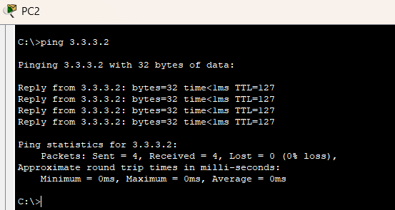

# Отчёт по уроку 8 — Использование коммутатора третьего уровня

**Дата прохождения:** 25.06.2025  
**Видеоурок:** [Смотреть на VK](https://vkvideo.ru/playlist/-32477510_12/video-32477510_456239179)
**Связанный урок:** [8.L3_switch](../8.L3_switch/README.md)

---

## Цель урока

- Повторить основы VLAN
- Научиться настраивать IP-интерфейсы на L3-коммутаторе
- Организовать маршрутизацию между VLAN
- Практиковать trunk-подключения
- Проверить сетевую связанность между хостами

---

## Теория

**L3-коммутатор (коммутатор третьего уровня)**:

- Работает на сетевом уровне (L3 OSI)
- Позволяет маршрутизировать трафик между VLAN
- Используется на уровне **распределения** в сетевой модели
- Обеспечивает высокую пропускную способность и скорость за счёт аппаратной маршрутизации
- Часто заменяет связку «маршрутизатор + L2-коммутаторы» в корпоративной среде

---

## Практика

### Часть 1 — Базовая маршрутизация на L3-коммутаторе

**Оборудование:**
- 1x L3 Switch
- 3x ПК (по одному в каждой VLAN)

**Настройка:**

- VLAN:
  - VLAN 2 → PC0 (2.2.2.2/24 → GW: 2.2.2.1)
  - VLAN 3 → PC1 (3.3.3.3/24 → GW: 3.3.3.1)
  - VLAN 4 → PC2 (4.4.4.4/24 → GW: 4.4.4.1)

- Настроены интерфейсы VLAN (SVI) на коммутаторе:

```bash
interface vlan 2
 ip address 2.2.2.1 255.255.255.0
 no shutdown

interface vlan 3
 ip address 3.3.3.1 255.255.255.0
 no shutdown

interface vlan 4
 ip address 4.4.4.1 255.255.255.0
 no shutdown 
```

- Включена маршрутизация

```bash
Switch(config) ip routing
```

- Проверка: ping между ПК-успешно




### Часть 2 - Расширенная топология с L2-коммутаторами 

**Оборудование:**
- 1x L3 Switch
- 2х L2 Switch (Switch0, Switch1)
- 4x ПК (Подключены к L2-коммуататорам)

### Схема IP-адресации
| ПК | VLAN | IP | Шлюз |
|----|------|----|------|
| PC3 | 2 | 2.2.2.2 | 2.2.2.1 |
| PC4 | 3 | 3.3.3.2 | 3.3.3.1 |
| PC5 | 2 | 2.2.2.2 | 2.2.2.1 |
| PC6 | 3 | 3.3.3.3 | 3.3.3.1 |

- Настроены VLAN на всех коммутаторах
- Access-порты назначены для ПК
- Настроены Trunk-порты между L2 и L3 коммутаторами с dot1q:
```bash
interface gigabitethernet 0/1
 switchport trunk encapsulation dot1q
 switchport mode trunk
 switchport trunk allowed vlan 2,3
```

- На L3-коммутаторе:
  - SVI-интерфейсы для VLAN 2 и 3
  - Включена IP-маршрутизация

- Проверки:
  - show ip route
  - show ip interface brief
  - Успешный ping между всеми ПК через L3-коммутатор

---

## Выводы
 - L3-коммутатор позволяет маршрутизировать трафик без внешнего маршрутизатора.
 - Trunk-порты и dot1q инкапсуляция — критичны для VLAN-связности между коммутаторами.
 - Комбинация L3 и L2-коммутаторов позволяет масштабировать сеть.
 - show-команды — ключевой инструмент диагностики (особенно: show run, show vlan brief, show ip interface brief).
 - Пропускная способность и быстродействие зависят от используемых линков (использовать гигабитные или выше).

[Вернуться к README](./README.md)