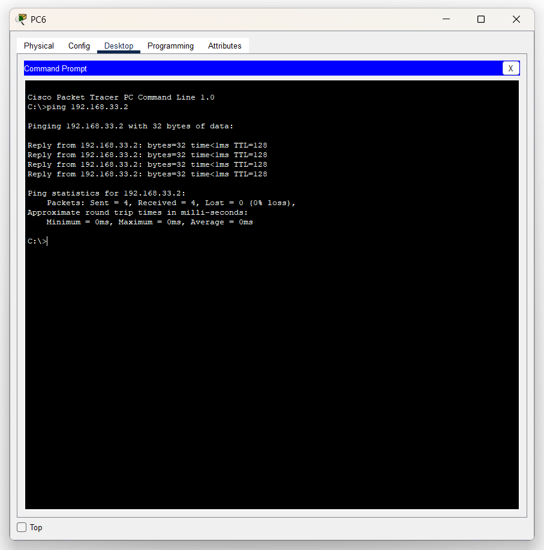

# Урок N9 - Маршрутизация

**Дата:** 26.06.2025

**Видеоурок:** [9.Видео уроки Cisco Packet Tracer. Курс молодого бойца. Маршрутизатор](https://vkvideo.ru/playlist/-32477510_12/video-32477510_456239178)

**Цель урока:** Повторение ранее изученного материала

---

## Основные задачи 
- Разобрать взаимодействие L3 коммутатора и маршрутизатора
- Посмотреть на работу маршрутизатора в небольшой сети

---

## Теория
- Маршрутизирующее оборудование функционирует на 3-ем уровне модели OSI
- **L3 коммутатор**:
  - Внутрисетевой роутинг между VLAN
  - Высокая производительность благодаря ASIC
  - Применяется на уровня распределения
- **Маршрутизатор**:
  - Подключение к глобальной сети
  - NAT, VPN, Firewall

---

## Практика

### Моделирование небольшого офиса

#### Топология
- 1х Router 1841 (Router0)
- 1х L2 Switch 2960 (Switch0)
- 3х PC (PC0, PC1, PC2)

#### Схема IP-адресации:

|Устройство| IP-адресс   | Шлюз        | Маска сети    | № Vlan | Vlan name |
|----------|-------------|-------------|---------------|---------|-----------| 
| PC0      | 192.168.2.2 | 192.168.2.1 | 255.255.255.0 |    2    |   VLAN2   |
| PC1      | 192.168.3.2 | 192.168.3.1 | 255.255.255.0 |    3    |   VLAN3   |
| PC2      | 192.168.4.2 | 192.168.4.1 | 255.255.255.0 |    4    |   VLAN4   |


#### Настройка
- Настройка VLAN и trunk на коммутаторе
- Sub-интерфейсы на маршрутизаторе (Router-on-a-Stick)
- Проверка связанности с помощью 'ping'

- Провести конфигурацию Switch0

```bash
# Создать vlan
Switch(config) vlan 2
Switch(config-vlan) name VLAN2

# Компьютер отнести к vlan
Switch(config) interface fastethernet 0/1
Switch(config-if) switchport mode access
Switch(config-if) switchport access vlan 2

# Сделать линк с роутером trunk
Switch(config) interface fastethernet 0/24
Switch(config-if) switchport mode trunk 
Switch(config-if) switchport trunk allowed vlan 2,3,4
```

- Провести конфигурацию Router0

```bash
# Поднять Fa0/0
Router(config) interface fastEthernet 0/0
Router(config-if) no shutdown 

# Создать sub-интерфейсы для vlan
Router(config) interface fastEthernet 0/0.2

# Указать номер vlan и задать IP-адрес
Router(config-subif) encapsulation dot1Q 2
Router(config-subif) ip address 192.168.2.1 255.255.255.0
Router(config-subif) no shutdown 
```

- vlan 2 на роутере приземлён. Надо аналогично приземлить vlan 3 и 4

```bash
# Создать sub-интерфейс для vlan 3
Router(config) interface fastEthernet 0/0.3
Router(config-subif) encapsulation dot1Q 3
Router(config-subif) ip address 192.168.3.1 255.255.255.0
Router(config-subif) no shutdown 

# Создать sub-интерфейс для vlan 4
Router(config) interface fastEthernet 0/0.4
Router(config-subif) encapsulation dot1Q 4
Router(config-subif) ip address 192.168.4.1 255.255.255.0
Router(config-subif) no shutdown 
```
- Проверить show run


- Проверить ping соседних сегментов


---

### Моделирование крупного офиса

#### Топология
- 1х Router 2911 (Router1)
- 1х L3 Switch 3560 (Multiplayer Switch0)
- 2х Server (Server0, Server1)
- 3х L2 Swirch 2960 (Switch1, Switch2, Switch3)
- 4х PC (PC3, PC4, PC5, PC6)

#### Схема IP-адресации

|Устройство| IP-адресс    | Шлюз        | Маска сети    | № Vlan | Vlan name |
|----------|--------------|-------------|---------------|---------|-----------| 
| PC3      | 192.168.22.2 | 192.168.2.1 | 255.255.255.0 |    2    |   VLAN2   |
| PC4      | 192.168.33.2 | 192.168.3.1 | 255.255.255.0 |    3    |   VLAN3   |
| PC5      | 192.168.22.3 | 192.168.2.1 | 255.255.255.0 |    2    |   VLAN2   |
| PC6      | 192.168.33.3 | 192.168.4.1 | 255.255.255.0 |    3    |   VLAN3   |
| Server0  | 192.168.44.2 | 192.168.4.1 | 255.255.255.0 |    4    |   VLAN4   |
| Server1  | 192.168.44.3 | 192.168.4.1 | 255.255.255.0 |    4    |   VLAN4   |


#### Настройка:
- VLAN и Trunk на L2-коммутаторах
- VLAN-интерфейсы (SVI) на L#-коммутаторе
- Соединение с маршрутизатором через VLAN 5
- Проверка связности

- Кофнигурация Switch1

```bash
# Создать vlan
Switch(config) vlan 2
Switch(config-vlan) name VLAN2

# Задать access
Switch(config) interface fastEthernet 0/1
Switch(config-if) switchport mode access 
Switch(config-if) switchport access vlan 2

# Создать vlan
Switch(config) vlan 3
Switch(config-vlan) name VLAN3

# Задать access
Switch(config) interface fastEthernet 0/2
Switch(config-if) switchport mode access 
Switch(config-if) switchport access vlan 3

# Задать Trunk-порт
Switch(config) interface fastEthernet 0/3
Switch(config-if) switchport mode trunk 
Switch(config-if) switchport trunk allowed vlan 2,3,4
```
- Аналогичную конфигурацию сделать на Switch 2


- Настройка Switch 3
```bash
# Создать vlan
Switch(config) vlan 4
Switch(config-vlan) name VLAN4

# Задать access
Switch(config) interface range fastEthernet 0/1-2
Switch(config-if-range) switchport access vlan 4

# Задать Trunk-порт
Switch(config) interface fastEthernet 0/3
Switch(config-if) switchport mode trunk 
Switch(config-if) switchport trunk allowed vlan 2,3,4
```


---

- Настроить L3 Switch

```bash
# Задать инкапсуляцию dot1q и trunk
Switch(config) vlan 2
Switch(config-vlan) name VLAN2
Switch(config) interface fastEthernet 0/1
Switch(config-if) switchport trunk encapsulation dot1q 
Switch(config-if) switchport mode trunk 
Switch(config-if) switchport trunk allowed vlan 2-3

Switch(config) vlan 3
Switch(config-vlan) name VLAN3
Switch(config) interface fastEthernet 0/2
Switch(config-if) switchport trunk encapsulation dot1q 
Switch(config-if) switchport mode trunk 
Switch(config-if) switchport trunk allowed vlan 2-3

Switch(config) vlan 4
Switch(config-vlan) name VLAN4
Switch(config) interface fastEthernet 0/3
Switch(config-if) switchport trunk encapsulation dot1q 
Switch(config-if) switchport mode trunk 
Switch(config-if) switchport trunk allowed vlan 4

# Поднять виртуальные интерфейсы и сконфигурировать IP-адреса
Switch(config) interface vlan 2
Switch(config-if) ip address 192.168.22.1 255.255.255.0

Switch(config) interface vlan 3
Switch(config-if) ip address 192.168.33.1 255.255.255.0

Switch(config) interface vlan 4
Switch(config-if) ip address 192.168.44.1 255.255.255.0
```

- Проверить взаимодействие хостов



- Создать vlan 5 для Router1
```bash
# Создать vlan и поднять интерфейс (up)
Switch(config) vlan 5
Switch(config-vlan) name VLAN5
Switch(config) interface vlan 5
Switch(config-if) ip address 192.168.55.2 255.255.255.0
Switch(config-if) no shutdown 

# Определить access-порт
Switch(config) interface gigabitEthernet 0/1
Switch(config-if) switchport mode access 
Switch(config-if) switchport access vlan 5
```

---

- Настроить Router1
```bash
# Поднять интерфейс gi0/0 и задать IP-адрес
Router(config) int gigabitEthernet 0/0
Router(config-if) no shutdown 
Router(config-if)#ip address 192.168.55.1 255.255.255.0

# Проверить связь с L3 коммутатором
```


---

## Вывод
- Коммутаторы L3 - маршрутизируют на аппаратном уровне, обеспечивая высокую производительность.

- Маршрутизаторы обрабатывают пакеты программно, но могут использовать  ускорение.

- Некоторые маршрутизаторы поддерживают аппаратное ускорение но стоят дороже L3 коммутаторов.

- Современный маршрутизатор можно превратить в полноценный сетевой экран.

- **В общем и целом создаётся такая картина, что если на предприятии есть только маршрутизатор, добавив в сеть предприятия коммутатор L3 - то, он очень сильно ускорит все процессы происходящие в сети, будет выполнять функцию своеобразного усилителя.**

- L3 коммутаторы поддерживают несколько типов инкапсуляции, поэтому им надо задавать инкапсуляцию точно, без этого trunk не сработает. А L2 коммутаторы часто поддерживают только dot1q инкапсуляцию и сразу берут её по умолчанию. 


---

## Ошибки
- Подключил PC2 в порт Fa0/3, а конфигурацию для этого ПК сделал на порте 0/4.
